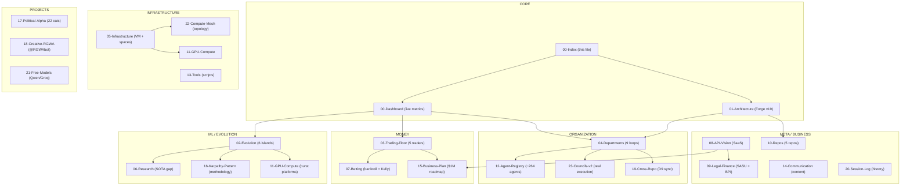

# Nomos42 — Map of Content

> 24 interconnected notes | Forge v19 (3 Layers × 9 Depts) | Trading Floor v4 | Engine v3.1-46cat
> Start here or at [[00-Dashboard]] for live metrics.

---

## The Big Picture

---

## All 24 Notes

### Core (Start Here)

| # | Note | Purpose | Key Metric |
|---|------|---------|------------|
| -- | [[00-Index]] | This MOC, navigation map | -- |
| 00 | [[00-Dashboard]] | Live system overview, all metrics at a glance | Brier 0.21570 |
| 01 | [[01-Architecture]] | Forge v19, 3 layers, 9 depts, Mermaid diagrams | 9 depts live |

### ML & Evolution

| # | Note | Purpose | Key Metric |
|---|------|---------|------------|
| 02 | [[02-Evolution]] | 6 HF islands, GA configs, Brier scores, feature engine | Fleet best 0.22159 |
| 06 | [[06-Research]] | SOTA gap, 18 techniques, papers, feature roadmap | Gap: 0.0167 |
| 11 | [[11-GPU-Compute]] | All GPU platforms: Kaggle, Colab, ZeroGPU, Lightning, Modal | ATR Colab T4 |
| 16 | [[16-Karpathy-Pattern]] | Autoresearch methodology, 5-min loops, council structure | 12 iter/hr |

### Money

| # | Note | Purpose | Key Metric |
|---|------|---------|------------|
| 03 | [[03-Trading-Floor]] | 5 NBA + 5 Political AI traders, strategies, P&L | Grok $3,687 |
| 07 | [[07-Betting]] | Live bankroll, Kelly sizing, bet categories, bugs | ROI -8.11% |
| 15 | [[15-Business-Plan]] | API marketplace, SaaS pricing, TAM, financial projections | $23K MRR Y1 |

### Organization

| # | Note | Purpose | Key Metric |
|---|------|---------|------------|
| 04 | [[04-Departments]] | All 9 department councils, Karpathy loops, status | 9/9 active |
| 12 | [[12-Agent-Registry]] | ~264 agents, roles, council + trader structure | ~196 running |
| 19 | [[19-Cross-Repo]] | D9 cross-repo sync, feature parity, cross-pollination | 5 repos |
| 23 | [[23-Councils-v2]] | Smart councils with real execution (v1 vs v2) | 9 councils |

### Infrastructure

| # | Note | Purpose | Key Metric |
|---|------|---------|------------|
| 05 | [[05-Infrastructure]] | VM, HF Spaces, crons, bots, databases | 6/6 spaces UP |
| 13 | [[13-Tools]] | Bloomberg terminal, scripts, monitoring, data files | 36 crons |
| 22 | [[22-Compute-Mesh]] | Full topology: VM + Laptop + iPad + Cloud | Tailscale mesh |

### Projects

| # | Note | Purpose | Key Metric |
|---|------|---------|------------|
| 17 | [[17-Political-Alpha]] | 22 categories, 743 features, political ETF trading | Brier 0.23134 |
| 18 | [[18-Creative-RGWA]] | AI art generation, @RGWAbot, D8 Creative | IDLE |
| 21 | [[21-Free-Models]] | Free inference: Qwen/Groq/Cerebras/Ollama stack | 2.8M+ tokens/mo |

### Meta / Business

| # | Note | Purpose | Key Metric |
|---|------|---------|------------|
| 08 | [[08-API-Vision]] | API-first architecture, SaaS tiers, dashboard | $19/$49/$149 |
| 09 | [[09-Legal-Finance]] | SASU holding, BPI Deeptech, costs, compliance | ~$20/mo burn |
| 10 | [[10-Repos]] | All 5 repos + subtree with health | 5 active repos |
| 14 | [[14-Communication]] | Social media, Telegram bots, investor deck | PRE-LAUNCH |
| 20 | [[20-Session-Log]] | Key decisions and milestones, dated | 2026-04-04 |

---

## Navigation Paths (Use Cases)

| Goal | Route |
|------|-------|
| **Morning status check** | [[00-Dashboard]] → check alerts → [[07-Betting]] |
| **Dive into ML** | [[02-Evolution]] → [[06-Research]] → [[16-Karpathy-Pattern]] → [[11-GPU-Compute]] |
| **Follow the money** | [[07-Betting]] → [[03-Trading-Floor]] → [[15-Business-Plan]] |
| **System health** | [[05-Infrastructure]] → [[22-Compute-Mesh]] → [[11-GPU-Compute]] → [[13-Tools]] |
| **Org chart** | [[01-Architecture]] → [[04-Departments]] → [[12-Agent-Registry]] → [[23-Councils-v2]] |
| **Big picture / pitch** | [[08-API-Vision]] → [[15-Business-Plan]] → [[09-Legal-Finance]] |
| **All repos** | [[10-Repos]] → [[19-Cross-Repo]] |
| **Political** | [[17-Political-Alpha]] → [[03-Trading-Floor]] |
| **Infrastructure deep** | [[22-Compute-Mesh]] → [[21-Free-Models]] → [[11-GPU-Compute]] |
| **History** | [[20-Session-Log]] |

---

## Tag Index

| Tag | Notes |
|-----|-------|
| #nomos42 | All 24 notes |
| #evolution #HF-spaces | [[02-Evolution]], [[05-Infrastructure]], [[22-Compute-Mesh]] |
| #trading-floor | [[03-Trading-Floor]], [[12-Agent-Registry]] |
| #karpathy-loop | [[16-Karpathy-Pattern]], [[04-Departments]], [[23-Councils-v2]] |
| #GPU #compute | [[11-GPU-Compute]], [[22-Compute-Mesh]], [[21-Free-Models]] |
| #betting #bankroll | [[07-Betting]], [[03-Trading-Floor]], [[15-Business-Plan]] |
| #research #SOTA | [[06-Research]], [[02-Evolution]] |
| #political | [[17-Political-Alpha]], [[03-Trading-Floor]] |
| #departments #councils | [[04-Departments]], [[23-Councils-v2]], [[12-Agent-Registry]] |
| #infrastructure | [[05-Infrastructure]], [[22-Compute-Mesh]], [[13-Tools]] |
| #business #API #SaaS | [[08-API-Vision]], [[15-Business-Plan]], [[09-Legal-Finance]] |

---

## Key Numbers (2026-04-04)

| Metric | Value | Target | Note |
|--------|-------|--------|------|
| Best Brier (ATR) | **0.21570** | < 0.20 | TabICL Colab T4, iter 15 |
| SOTA (Montrucchio 2026) | **0.199** | Beat it | Gap: 0.0167 |
| Fleet best | 0.22159 | < 0.22 | S15 random_forest, gen 1,042 |
| HF Spaces | 8/8 UP | 100% | 6 NBA + 2 Political |
| Departments | 9/9 active | all live | + Trading Floor |
| Trading Floor | Iter 402, Gen 54,672 | -- | Grok #1 $3,687 |
| Live bankroll | $91.89 | > $100 + 5% | ROI -8.11% (bugs pending) |
| Total agents | ~196 | 264 max | Theoretical full deployment |
| Burn rate | ~$20/mo | < $50 | Free infrastructure |

---

## Vault Tips

> [!tip] Obsidian Power Tips
> - **Ctrl+G** — Open Graph View (see all 24 notes as a network)
> - **Ctrl+O** — Quick switch between notes
> - **Ctrl+[** / **Ctrl+]** — Navigate back/forward
> - Click any `[[wikilink]]` to jump to that note
> - Left sidebar → Tags panel → browse by #tag
> - Right sidebar → Backlinks panel → see what links to current note
> - Left sidebar → Graph (4th icon) → local graph for current note

> [!info] Data freshness
> Most metrics come from live JSON files in `data/`.
> Updated every 4h by `autonomous-cycle.sh`.
> For real-time: `data/agent-health.json` or `data/infra-status.json`.
