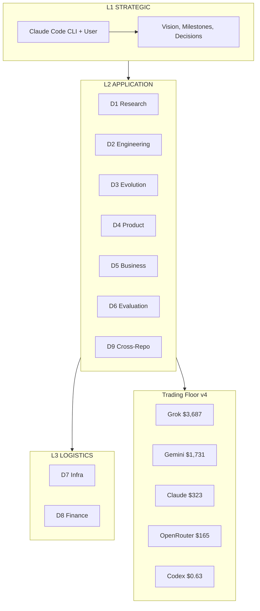
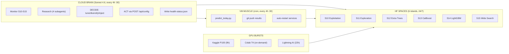
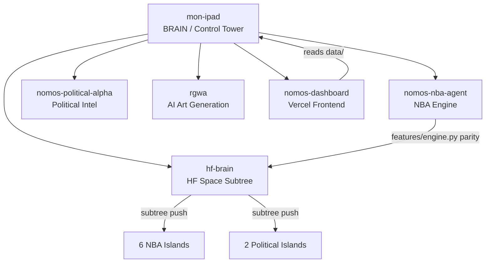

# 01 -- Architecture (Forge v19)

> 3 Layers x 9 Departments x 5 Repos + Trading Floor v4 | Deployed: 2026-04-03T20:02:58Z
> Inspired by: Karpathy autoresearch + Paperclip org charts + Conway always-on agents + Hermes swarm

---

## The 3-Layer Model

---

## 24/7 Autonomous Runtime

**Trigger ID:** `trig_01BS3ixBvt2uKHY9p5EemcgD`

---

## 9 Departments (Forge v19)

| Dept | Name | Layer | Karpathy Loop | Primary Metric | Cron |
|------|------|-------|---------------|----------------|------|
| D1 | Research | L2 | paper->extract->propose->measure | papers/week | `2 * * * *` |
| D2 | Engineering | L2 | code->test->measure Brier->keep/revert | Brier delta | `12 * * * *` |
| D3 | Evolution | L2 | mutate->eval->fitness->select | gen/hr, best Brier | `22 * * * *` |
| D4 | Product | L2 | ship->user->feedback->iterate | features shipped | `10 */2 * * *` |
| D5 | Business | L2 | pricing->onboard->conversion | MRR, ARPU | `0 8 * * *` |
| D6 | Evaluation | L2 | audit->identify->fix->verify | FP rate, calibration | `20 */2 * * *` |
| D7 | Infra | L3 | check->detect->fix->verify | uptime % | `40 */2 * * *` |
| D8 | Finance | L3 | track->report->reconcile->forecast | burn rate | `0 23 * * *` |
| D9 | Cross-Repo | L2 | sync->audit->fix->verify | parity score | custom |

Max run per loop: **5 minutes** | All follow [[16-Karpathy-Pattern]]

Full dept details: [[04-Departments]]

---

## Guardian Orchestrator v3

The Guardian sits above all departments and performs cross-pollination of wins.

| Property | Value |
|----------|-------|
| Last run | 2026-04-04T06:01:06Z |
| Departments loaded | 12/12 |
| Active routes | 1 (evolution -> evolution) |
| Wins this cycle | 0 |
| Pending actions | 3 (all MEDIUM) |

**Pending cross-pollination:**
1. Seed S10 with S14 config (Brier gain: +0.00545)
2. Seed S10 with S12 config (Brier gain: +0.00465)
3. Seed S11 with S14 config (Brier gain: +0.00433)

---

## Ecosystem Map

Full repo details: [[10-Repos]]

---

## Delegation Matrix

| Task | Model | Mechanism | Notes |
|------|-------|-----------|-------|
| Analysis, decisions, piloting | Opus 4.6 | Direct CLI | Strategic (L1) |
| 24/7 brain trigger | Sonnet 4.6 | Remote trigger | Every 4h |
| Batch execution, search | Sonnet 4.6 | Agent(model: "sonnet") | Parallel subagents |
| Codebase exploration | Haiku 4.5 | Agent(model: "haiku") | Fast scanning |
| Free model council | Qwen/Gemma/Mistral | HF Inference API | Advisor roles |

---

## Hard Rules

> [!warning] Inviolable constraints
> 1. **ZERO ML on VM** -- 1 vCPU / 969 MB RAM. ALL training on HF/Kaggle/Colab
> 2. **Feature engine parity** -- `features/engine.py` == `hf-space/features/engine.py`
> 3. **1 fix per iteration** -- never multiple simultaneous changes
> 4. **MAX_FEATURES=200** -- hard cap enforced in init/mutate/crossover
> 5. **Mutation cap** -- adaptive mutation capped at 0.15
> 6. **CPU-only islands** -- no neural models (tree-based only), stacking removed
> 7. **NEVER build on VM** -- no `next build` / `tsc`, push to Vercel instead

---

## Links

[[00-Dashboard]] | [[02-Evolution]] | [[04-Departments]] | [[05-Infrastructure]] | [[10-Repos]] | [[12-Agent-Registry]] | [[16-Karpathy-Pattern]] | [[21-Free-Models]] | [[22-Compute-Mesh]] | [[23-Councils-v2]]
