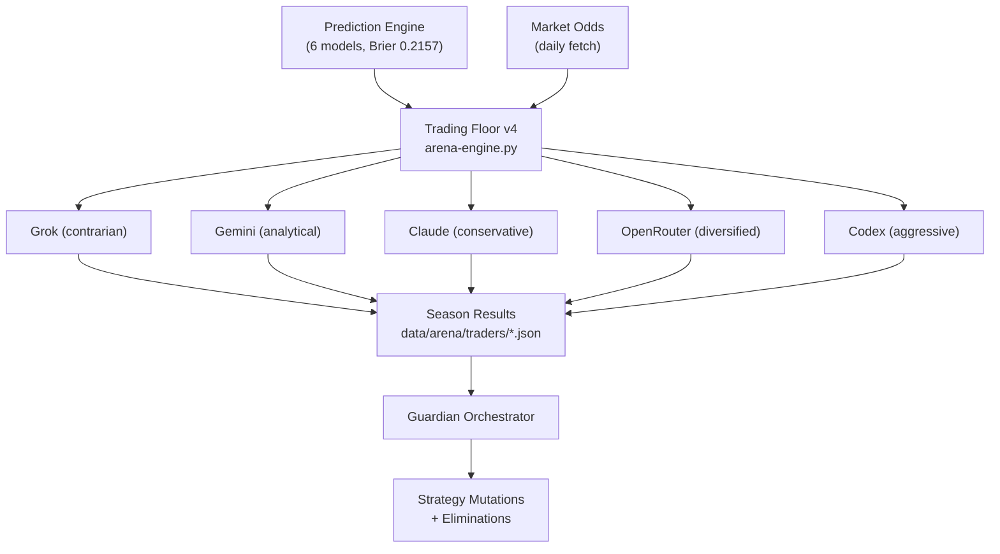

# 03 -- Trading Floor v4

> 5 NBA + 5 Political AI traders | Iter 402 | Gen 54,672 | Season 2025-26 | Last: 2026-04-04

---

## NBA Season Leaderboard

| Rank | Agent | Provider | Personality | Risk | Bankroll | ROI | Sharpe | Bets | Record | Peak | Max DD |
|------|-------|----------|-------------|------|----------|-----|--------|------|--------|------|--------|
| 1 | **Grok** | xAI | contrarian | 0.65 | **$3,687.51** | **+3,587.5%** | **4.672** | 1,228 | 523W-705L | $3,816 | 53.5% |
| 2 | Gemini | Google | analytical | 0.60 | $1,731.08 | +1,631.1% | 2.660 | 3,554 | 1753W-1801L | $1,885 | 77.0% |
| 3 | Claude | Anthropic | conservative | 0.40 | $322.86 | +222.9% | 4.423 | 1,936 | 961W-975L | $330 | 38.4% |
| 4 | OpenRouter | Multi | diversified | 0.50 | $164.63 | +64.6% | 0.560 | 2,125 | 1036W-1089L | $231 | 93.5% |
| 5 | Codex | OpenAI | aggressive | 0.70 | $0.63 | -99.4% | -0.268 | 4,232 | 2177W-2055L | $665 | 100% |

All started: **$100.00** virtual | Season: 2025-10-21 to present

---

## Agent Profiles

### T1 -- Grok (CHAMPION)

> [!tip] The winning formula
> Contrarian personality + value_hunter strategy + simple models (elo_baseline) + low frequency = massive edge

| Property | Value |
|----------|-------|
| Provider | xAI |
| Strategy | value_hunter + underdog_specialist |
| Total wagered | $13,698.91 |
| Key insight | Fewer bets (1,228) but much higher edge per bet |

**Top models:** elo_baseline (+$1,996.73), random_forest (+$937.03), extra_trees (+$653.74)
**Top strategies:** value_hunter 280 bets (+$2,860.96), underdog_specialist 800 bets (+$728.21)
**Top categories:** alt_spread_home_big (+$2,016.79), alt_spread_away_big (+$1,302.49)

### T2 -- Gemini (#2)

| Property | Value |
|----------|-------|
| Provider | Google |
| Strategy | confidence_scaled + half_kelly |
| Total wagered | $16,086.64 |
| Bets | 3,554 (highest volume after Codex) |

### T3 -- Claude (#3, Best Risk-Adjusted)

| Property | Value |
|----------|-------|
| Provider | Anthropic |
| Strategy | quarter_kelly (all 1,936 bets) |
| Total wagered | $1,655.59 |
| Best categories | alt_spread_home_big (+$191.49), alt_spread_away_big (+$82.07) |

> [!info] Claude has Sharpe 4.423 -- nearly matching Grok (4.672) with far less volatility

### T4 -- OpenRouter (#4)

| Property | Value |
|----------|-------|
| Provider | Multi-model |
| Strategy | quarter_kelly + flat_2pct + value_hunter |
| Model mix | lightgbm + consensus_ensemble + extra_trees |

### T5 -- Codex (ELIMINATED)

> [!warning] Codex: A cautionary tale
> Aggressive (risk 0.7) + high frequency (4,232 bets) + no drawdown protection = ruin.
> Peak: $665.28 (day 4+) then catastrophic 100% drawdown to $0.63.

---

## Political Trading Floor

5 AI agents trade ETFs, index funds, and real stocks based on political signals.
Starting capital: **$100,000** virtual | 12 trading days so far.

| Rank | Agent | Capital | ROI | Sharpe | Trades | Win Rate | Strategy |
|------|-------|---------|-----|--------|--------|----------|----------|
| 1 | **Codex** | $101,083 | **+1.08%** | 6.569 | 113 | 52.2% | event_driven + momentum |
| 2 | Gemini | $100,790 | +0.79% | **12.289** | 118 | **61.0%** | momentum |
| 3 | OpenRouter | $100,204 | +0.20% | 5.440 | 95 | 49.5% | sector_rotation + insider_follow |
| 4 | Claude | $100,030 | +0.03% | 2.656 | 35 | 48.6% | mean_reversion |
| 5 | Grok | $99,708 | -0.29% | -13.441 | 60 | 36.7% | mean_reversion |

> [!info] Irony alert
> Codex is #1 in political (best ROI) but LAST in NBA (bankrupt). Different markets, different outcomes.
> Gemini has the best Sharpe (12.289) in political -- extremely consistent.

---

## Strategy Analysis

### What Wins in NBA

| Factor | Winner | Loser | Lesson |
|--------|--------|-------|--------|
| Personality | contrarian (Grok) | aggressive (Codex) | Bet against the crowd |
| Strategy | value_hunter | overtrading | Seek positive EV only |
| Model | elo_baseline | complex stacking | Simple beats complex for underdogs |
| Frequency | 1,228 bets (Grok) | 4,232 bets (Codex) | Quality over quantity |
| Kelly sizing | half_kelly sweet spot | full_kelly extreme | Manage variance |
| Category | alt_spread (home/away big) | standard spreads | Alternative lines have more edge |

### Backtest Strategy Rankings

| Rank | Strategy | Avg ROI | Verdict |
|------|----------|---------|---------|
| 1 | full_kelly | +135,550% | ELITE (extreme variance) |
| 2 | anti_martingale | +125,583% | ELITE |
| 3 | proportional_edge | +73,112% | STRONG |
| 4 | ev_threshold_110 | +52,320% | STRONG |
| 5 | half_kelly | +34,739% | STRONG |

---

## Architecture

Each trader sees: all predictions, all strategies, peer results, market odds.
Each decides: which games, what size (Kelly), which model, which category.

Backend: `scripts/arena/arena-engine.py` (daily at 11:00)
Data: `data/arena/traders/*.json` + `data/arena/docs/*-season-2025-26.md`

---

## Key Lessons for Live Betting

1. **Grok's value_hunter** is the production target for the live agent -- see [[07-Betting]]
2. **quarter_kelly** (Claude) offers best risk-adjusted returns for conservative mode
3. **half_kelly** is the sweet spot for balance
4. **elo_baseline** beats complex ML for underdog hunting
5. **alt_spread categories** (home/away big) have highest alpha

---

## Links

[[00-Dashboard]] | [[07-Betting]] | [[04-Departments]] | [[06-Research]] | [[17-Political-Alpha]] | [[15-Business-Plan]]
