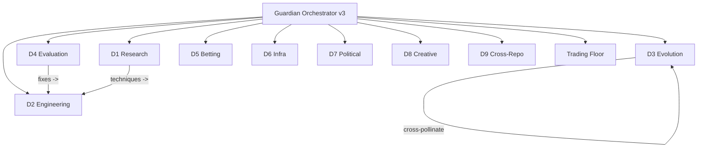

# 04 -- Departments (9 Karpathy Loops + Trading Floor)

> Forge v19 | Guardian Orchestrator v3 | All depts: SCAN -> PROPOSE -> EXECUTE (5 min) -> EVALUATE -> KEEP/REVERT
> Pattern: [[16-Karpathy-Pattern]] | Agent registry: [[12-Agent-Registry]]

---

## Department Status Overview (Live from council JSONs)

| Dept | Name | Layer | Status | Iter | Last Run | Cron | Key Metric |
|------|------|-------|--------|------|----------|------|------------|
| D1 | Research | L2 | ACTIVE | 6 | 2026-04-04T09:02 | `2 * * * *` | 18 scans |
| D2 | Engineering | L2 | ACTIVE | 6 | 2026-04-04T09:12 | `12 * * * *` | Brier 0.2157 |
| D3 | Evolution | L2 | ACTIVE | 8 | 2026-04-04T09:22 | `22 * * * *` | 4,222 gens |
| D4 | Evaluation | L2 | ACTIVE | 5 | 2026-04-04T08:20 | `20 */2 * * *` | ROI -8.11% |
| D5 | Betting | L2 | completed | 1 | 2026-04-02 | `10 */2 * * *` | full_kelly ELITE |
| D6 | Infra | L3 | ACTIVE | 5 | 2026-04-04T08:40 | `40 */2 * * *` | 73.4% disk |
| D7 | Political | L2 | completed | 7 | 2026-04-02 | `0 8,20 * * *` | Kaggle RUNNING |
| D8 | Creative | L2 | IDLE | 4 | 2026-04-02 | `0 9,21 * * *` | 0 pieces |
| D9 | Cross-Repo | L2 | ACTIVE | -- | -- | custom | Parity sync |
| TF | Trading Floor | -- | ACTIVE | 402 | 2026-04-04 | `0 11 * * *` | Gen 54,672 |

Council state files: `data/departments/council-<dept>.json`
Runner: `scripts/councils/department-council.sh <dept>`

---

## D1 -- Research

**Loop:** paper -> extract -> propose -> measure
**Metric:** papers/week, techniques tested
**State:** 6 iterations, 18 scans completed, 0 new papers found recently

| Property | Value |
|----------|-------|
| Papers scanned | 14 total |
| Techniques extracted | 18 |
| SOTA reference | Montrucchio 2026 (Brier 0.199) |
| Gap to close | 0.0167 |

Latest proposals: Platt scaling, isotonic regression, ensemble stacking, drive-rim features, play-type PPP

Full roadmap: [[06-Research]]

---

## D2 -- Engineering

**Loop:** code -> test -> measure Brier -> keep/revert
**Metric:** Brier delta, test pass rate
**State:** 6 iterations | Current Brier: 0.2157 (stable, monitoring for drift)

> [!info] Brier healthy at 0.2157 -- no drift detected across 3 consecutive iterations

Pending tasks (from D4 Evaluation):
1. **Phantom game guard** (home != away assertion) -- trivial effort
2. **Platt scaling calibration** -- expected Brier delta: -0.008, ECE delta: -0.17
3. **Odds sanity gate** (reject |model_prob - market_implied| > 0.50) -- small effort
4. **Home court advantage** 2.8 -> 2.2 pts -- expected Brier delta: -0.002

---

## D3 -- Evolution

**Loop:** mutate -> eval -> measure fitness -> select
**Metric:** gen/hr, best Brier, diversity
**State:** 8 iterations | 4,222 total generations | 0 stagnant islands

| Property | Value |
|----------|-------|
| Fleet best | 0.22159 (S15 random_forest) |
| Fleet avg | 0.22419 |
| Diversity score | 0.567 |
| Cross-pollination pending | 3 actions |

Full details: [[02-Evolution]]

---

## D4 -- Evaluation (Critical)

**Loop:** audit -> identify -> fix -> verify
**Metric:** false positive rate, calibration
**State:** 5 iterations | Flagging ROI -8.11% and Sharpe -2.99

### Biases Detected

| Type | Severity | Detail | Fix | Status |
|------|----------|--------|-----|--------|
| PHANTOM_GAME | CRITICAL | BKN vs BKN (home==away), prob 0.6128 | Assert home != away | PROPOSED |
| OVERCONFIDENCE | HIGH | ECE 0.2758, worst bucket 60-70% | Platt scaling | PROPOSED |
| CORRUPTED_ODDS | HIGH | 5 bets, model >60% but market <15% (SAS bug) | Odds sanity gate | PROPOSED |
| HOME_BIAS | LOW | 21 home bets WR 38.1% vs 40% away | Reduce home_court 2.8->2.2 | PROPOSED |

### Corruption Examples (SAS normalization bug)

| Date | Game | Model Prob | Market Implied | Edge | Won |
|------|------|-----------|----------------|------|-----|
| 2026-03-21 | IND @ SAS | 68.3% | 9.1% | 6.5x | LOST |
| 2026-03-25 | SAS @ MEM | 67.9% | 10.3% | 5.6x | LOST |
| 2026-03-27 | HOU @ MEM | 60.7% | 13.8% | 3.4x | LOST |

### Improvements Priority Queue

| # | Type | Title | Effort | Expected Delta |
|---|------|-------|--------|----------------|
| 1 | BUG_FIX | Phantom game guard | trivial | eliminates phantom bets |
| 2 | CALIBRATION | Platt scaling | medium | Brier -0.008, ECE -0.17 |
| 3 | BUG_FIX | Odds sanity gate | small | eliminates 8 bad bets |
| 4 | FEATURE | Home court 2.8->2.2 pts | small | Brier -0.002 |
| 5 | MONITORING | Automated ECE alert >0.15 | small | early warning |

---

## D5 -- Betting

**Loop:** strategy -> backtest -> measure ROI -> keep/revert
**Metric:** ROI, Sharpe, Kelly edge

Strategy rankings: see [[07-Betting]]
Calibration: Kelly 0.35, min edge 3%, ELO K=22, home court 2.8 pts

---

## D6 -- Infra

**Loop:** check -> detect -> fix -> verify
**Metric:** uptime %, disk usage, RAM
**State:** 5 iterations | Disk 73.4% | RAM ~211 MB free | Spaces 6/6 UP

> [!warning] RAM pressure
> Only 170-270 MB free on 969 MB VM. Infra dept monitoring for idle processes to kill.

Full details: [[05-Infrastructure]]

---

## D7 -- Political

**Loop:** signal -> feature -> measure alpha -> keep/revert
**Metric:** political Brier, ETF ROI

| Property | Value |
|----------|-------|
| Version | v3.1 |
| Categories | 22 |
| Features | 743 |
| Kaggle | RUNNING |
| P1_pol Brier | 0.24997 (gen 326) |
| P2_pol Brier | 0.23134 (gen 6,030) |

Full details: [[17-Political-Alpha]]

---

## D8 -- Creative (RGWA)

**Loop:** generate -> quality -> curate -> publish
**Metric:** quality score, output/day
**State:** IDLE | 4 iterations | 0 pieces generated

> [!info] RGWA is idle -- needs first generation run to activate the Karpathy loop

Bot: @RGWAbot | Repo: rgwa | Details: [[18-Creative-RGWA]]

---

## D9 -- Cross-Repo

**Loop:** sync -> audit -> fix -> verify
**Metric:** parity score, uncommitted changes across repos

Current cross-repo health:
- mon-ipad: 11 uncommitted
- nomos-nba-agent: 18 uncommitted
- nomos-political-alpha: 364 uncommitted
- rgwa: 13 uncommitted

Full details: [[19-Cross-Repo]]

---

## Guardian Orchestrator v3

| Property | Value |
|----------|-------|
| Last run | 2026-04-04T06:01:06Z |
| Departments loaded | 12/12 |
| Active cross-pollination routes | 1 |
| Wins this cycle | 0 |
| Pending actions | 3 MEDIUM |

---

## Links

[[00-Dashboard]] | [[01-Architecture]] | [[02-Evolution]] | [[05-Infrastructure]] | [[06-Research]] | [[07-Betting]] | [[12-Agent-Registry]] | [[16-Karpathy-Pattern]] | [[23-Councils-v2]]
