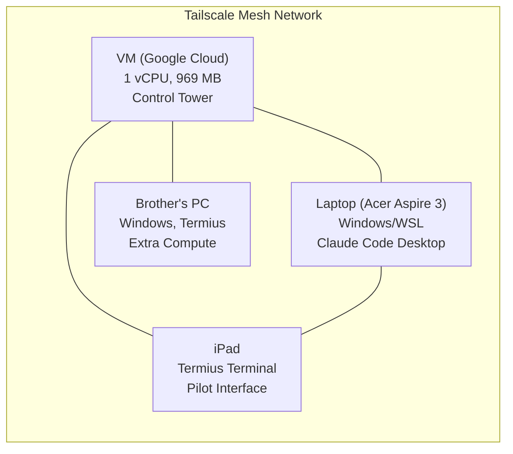

# 05 -- Infrastructure

> 5 repos | 8 HF spaces (6 NBA + 2 political) | 2 bots | 36 crons | Tailscale mesh | Updated: 2026-04-04T09:18Z

---

## Compute Nodes

| Node | Type | Specs | Role | Status |
|------|------|-------|------|--------|
| VM (iPad terminal) | Google Cloud VPS | 1 vCPU, 969 MB RAM | Control tower, brain, crons | ACTIVE |
| Laptop | Local (Windows/WSL) | Acer Aspire 3 | Claude Code Desktop, Ollama | ACTIVE |
| Brother's PC | 3rd node | Windows, Termius | Extra compute, via Tailscale | PENDING SETUP |
| iPad | Terminal client | Termius | Pilot interface | ACTIVE |

> [!warning] ZERO ML on VM
> 1 vCPU / 969 MB RAM. ALL training goes to HF Spaces, Kaggle, Colab. See [[11-GPU-Compute]].

---

## HF Spaces Status (Live)

### NBA Evolution (Nomos42 account)

| Space | Space ID | URL | Status | Brier | Gen |
|-------|----------|-----|--------|-------|-----|
| S10 | Nomos42/nba-quant | nomos42-nba-quant.hf.space | RUNNING | 0.22454 | 419 |
| S11 | Nomos42/nba-quant-2 | nomos42-nba-quant-2.hf.space | RUNNING | 0.22273 | 707 |
| S12 | Nomos42/nba-evo-3 | nomos42-nba-evo-3.hf.space | RUNNING | 0.22506 | 932 |
| S13 | Nomos42/nba-evo-4 | nomos42-nba-evo-4.hf.space | RUNNING | 0.22455 | 652 |
| S14 | Nomos42/nba-evo-5 | nomos42-nba-evo-5.hf.space | RUNNING | 0.22666 | 697 |
| S15 | Nomos42/nba-evo-6 | nomos42-nba-evo-6.hf.space | RUNNING | 0.22159 | 1,042 |

### Political Evolution

| Space | Status | Brier | Gen |
|-------|--------|-------|-----|
| P1_pol | RUNNING | 0.24997 | 326 |
| P2_pol | RUNNING | 0.23134 | 6,030 |

### HF Accounts (3 accounts = 24 space slots)

| Account | Token | Current Spaces | Capacity |
|---------|-------|----------------|----------|
| Nomos42 | HF_TOKEN_3 | 8 (6 NBA + 2 POL) | 8/8 FULL |
| LBJLincoln | HF_TOKEN | 3 (to delete) | 0/8 after cleanup |
| LBJLincoln26 | HF_TOKEN_2 | 4 (to delete) | 0/8 after cleanup |

> [!tip] Cleanup needed
> 13 dead spaces across LBJLincoln + LBJLincoln26 should be deleted.
> After cleanup: 10 free slots available for new experiments.

Keepalive: `scripts/keepalive-spaces.sh` (every 30 min)

---

## Cron Jobs (VM) -- 36 total

### Core Automation

| Schedule | Script | Purpose |
|----------|--------|---------|
| `*/5 * * * *` | watchdog.sh | System watchdog |
| `*/30 * * * *` | agent-cron.sh | Agent heartbeat |
| `17 */4 * * *` | multi-brain.sh | 4h brain cycle (Sonnet 4.6) |
| `0 */2 * * *` | cross-repo-monitor.py | Cross-repo health |
| `0 3 * * *` | kaggle-gpu-evolution.sh | Nightly Kaggle GPU |
| `0 4,16 * * *` | karpathy-scheduler.sh | Karpathy sessions |

### Data & Predictions

| Schedule | Script | Purpose |
|----------|--------|---------|
| `*/30 18-23,0-6 * * *` | fetch_free_odds.py | NBA odds during game hours |
| `0 22 * * *` | betting_agent.py | Daily betting |
| `0 10 * * *` | evaluate_predictions.py | Morning evaluator |
| `30 23 * * *` | daily-summary.py | Daily Telegram summary |

### Department Councils

| Dept | Schedule | Script |
|------|----------|--------|
| D1 Research | `2 * * * *` | department-council.sh research |
| D2 Engineering | `12 * * * *` | department-council.sh engineering |
| D3 Evolution | `22 * * * *` | department-council.sh evolution |
| D4 Evaluation | `20 */2 * * *` | department-council.sh evaluation |
| D5 Betting | `10 */2 * * *` | department-council.sh betting |
| D6 Infra | `40 */2 * * *` | department-council.sh infra |
| D7 Political | `0 8,20 * * *` | department-council.sh political |
| D8 Creative | `0 9,21 * * *` | department-council.sh creative |
| D9 Cross-Repo | custom | cross-repo-councils.sh |
| TF | `0 11 * * *` | trading-floor-v4.py |

### Weekly Maintenance

| Schedule | Script | Purpose |
|----------|--------|---------|
| `0 4 * * 0` | cross-pollinate.py | Weekly island cross-pollination |
| `0 0,4,8,12,16,20 * * *` | swarm-metrics-collector.sh | 6x daily metrics |
| `0 3 * * *` | backup-to-drive.sh | Google Drive backup |

---

## Telegram Bots

| Bot | Repo | Status | Purpose |
|-----|------|--------|---------|
| @Nomos42Bot | mon-ipad | ALIVE | NBA Brain -- predictions, analysis, research |
| @RGWAbot | rgwa | ALIVE | AI Art Terminal -- generation, gallery |

Channel: **@Nomos42** -- public predictions + daily summary

---

## Databases & Storage

| Service | Purpose | Status |
|---------|---------|--------|
| Supabase (xivvnr pooler) | NBA data, experiments, research_proposals | ACTIVE |
| Supabase (ayqviq primary) | Primary instance | PAUSED (402) |
| Neo4j | Knowledge graph (45 nodes) | CONNECTED |
| Google Drive | Backups (daily cron) | ACTIVE |
| GitHub | Source of truth for all code + data | ACTIVE |

### Repo Sizes

| Repo | Path | Size |
|------|------|------|
| mon-ipad | /home/termius/mon-ipad | 80 MB |
| nomos-nba-agent | /home/termius/nomos-nba-agent | 32 MB |
| nomos-political-alpha | /home/termius/nomos-political-alpha | 42 MB |
| rgwa | /home/termius/rgwa | 7 MB |
| nomos-dashboard | /home/termius/nomos-dashboard | ~0 MB |

---

## System Health Metrics (D6 Infra Council)

| Metric | Value | Threshold |
|--------|-------|-----------|
| Disk used | 73.4% | < 85% |
| RAM available | ~211 MB | > 150 MB |
| Spaces up | 6/6 NBA + 2/2 POL | 100% |
| Kaggle NBA | RUNNING | -- |
| Kaggle Political | RUNNING | -- |
| Data server | RUNNING | -- |

---

## Alerts

> [!warning] Infrastructure alerts
> 1. RAM pressure: 170-211 MB free (VM has 969 MB total)
> 2. Disk 73.4% and rising -- monitor for cleanup
> 3. 364 uncommitted changes in nomos-political-alpha
> 4. 18 uncommitted changes in nomos-nba-agent

---

## Links

[[00-Dashboard]] | [[01-Architecture]] | [[02-Evolution]] | [[04-Departments]] | [[10-Repos]] | [[11-GPU-Compute]] | [[13-Tools]]
