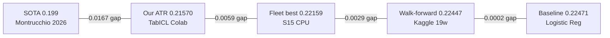

# 06 -- Research

> Research Cycle 7 | 14 papers scanned | 18 techniques extracted | SOTA gap: 0.0167 | D1 council: 6 iterations

---

## SOTA Position

| Source | Brier | Method | Notes |
|--------|-------|--------|-------|
| **Montrucchio 2026** | **0.199** | MDPI Information 17/1/56 | External SOTA |
| Our ATR | 0.21570 | TabICL ensemble, 110f | Colab T4, iter 15 |
| Our fleet best | 0.22159 | Random forest, CPU | S15 (gen 1,042) |
| Our fleet avg | 0.22419 | Tree ensemble, CPU | 6 HF islands |
| Our walk-forward | 0.22447 | Tree ensemble | 19 weeks, 934 games |

Target: **< 0.20** | Gap: **0.0157**

---

## 18 Techniques (Research Cycle 7)

### Tier 1 -- Expected Brier Impact > 0.005

| # | Technique | Expected Delta | Effort | Status |
|---|-----------|----------------|--------|--------|
| 1 | **TabICL** (In-Context Learning) | **-0.020+** | high | DEPLOYED (ATR) |
| 2 | Platt scaling / isotonic calibration | -0.008 | medium | PROPOSED (D4) |
| 3 | Drive-Rim features (Cat47) | -0.005 | medium | IN ENGINE |
| 4 | Passing efficiency features (Cat48) | -0.004 | medium | IN ENGINE |
| 5 | Play-Type PPP (Cat49) | -0.004 | medium | IN ENGINE |

### Tier 2 -- Expected Brier Impact 0.002-0.005

| # | Technique | Expected Delta | Effort | Status |
|---|-----------|----------------|--------|--------|
| 6 | Ensemble stacking (tree + ICL) | -0.004 | medium | BACKLOG |
| 7 | MOVDA rolling decay | -0.003 | small | DEPLOYED (v3.0) |
| 8 | EWMA exponential weighted stats | -0.003 | small | DEPLOYED (Cat36) |
| 9 | Cross-island GA seeding | -0.002 | small | PENDING (Guardian) |
| 10 | Home court advantage recalibration | -0.002 | small | PROPOSED (D4) |
| 11 | Poisson scoring model integration | -0.002 | small | DEPLOYED |

### Tier 3 -- Expected Brier Impact < 0.002

| # | Technique | Expected Delta | Effort | Notes |
|---|-----------|----------------|--------|-------|
| 12 | ELO K-factor tuning (22->?) | -0.001 | small | CALIBRATED |
| 13 | Monte Carlo stdev tuning (11.5->?) | -0.001 | small | CALIBRATED |
| 14 | Feature interaction detection | -0.002 | high | BACKLOG |
| 15 | Adversarial debiasing | -0.001 | high | RESEARCH |
| 16 | Odds movement features | -0.001 | medium | PARTIAL |
| 17 | Player props integration | -0.001 | medium | DATA READY |
| 18 | Lineup-based features | -0.002 | high | BACKLOG |

> [!tip] Path to 0.20
> TabICL (-0.020) + Platt scaling (-0.008) + new features (-0.005) = theoretical -0.033.
> Even partial delivery of top 5 techniques should push below 0.20.

---

## Feature Engine Roadmap

| Phase | Version | Categories | Key Additions | Status |
|-------|---------|------------|---------------|--------|
| Done | v3.0-37cat | 37 | EWMA (Cat36), MOVDA (Cat37) | DEPLOYED |
| Done | v3.1-46cat | 46 | Drive-Rim (47), Passing (48), Play-Type PPP (49) | DEPLOYED |
| Next | v3.2 | 50+ | Lineup-based, social signals | PLANNED |
| Future | v4.0 | 60+ | Neural feature extraction, graph features | RESEARCH |

Current: **v3.1-46cat** | 6,253 raw -> 3,216 usable -> 200 max selected

---

## ATR Improvement History

| Date | Brier | Delta | Model | Features | Platform |
|------|-------|-------|-------|----------|----------|
| 2026-03-16 | 0.22471 | -- | Logistic Regression | 24 | baseline |
| 2026-03-22 | 0.22041 | -0.00430 | XGBoost | 194 | S10 |
| 2026-03-25 | 0.21844 | -0.00197 | Extra Trees | 94 | Kaggle P100 |
| **2026-03-27** | **0.21570** | **-0.00274** | **TabICL ensemble** | **110** | **Colab T4** |

**Total improvement:** -0.00901 in 11 days (+4.1% relative)

---

## Papers & Sources

### Scanned (Research Cycle 7)
1. **Montrucchio 2026** (MDPI Information 17/1/56) -- NBA prediction, Brier 0.199 (SOTA)
2. TabICL paper -- in-context learning for tabular data
3. XGBoost v2.0 docs (xgboost_brier objective fix)
4. LightGBM feature importance methods
5. CatBoost ordered target encoding
6. Platt scaling for probability calibration
7. Isotonic regression calibration
8. Feature selection in genetic algorithms
9. Kelly criterion variants (quarter/half/full)
10. ELO rating systems in sports
11. Poisson regression for score prediction
12. Monte Carlo simulation for game outcomes
13. Drive-Rim data: NBA Advanced Stats
14. Play-type PPP: Synergy Sports

### Key Data Sources
- NBA.com/stats -- official boxscores, advanced (9,551 games trained)
- Basketball-Reference -- historical data
- Synergy Sports -- play-type PPP
- FiveThirtyEight ELO -- baseline reference
- Odds API / sportsbook feeds -- market signals

---

## Research Queue (Next Cycle)

1. Neural feature extraction (reduce 6,253 -> embedding space)
2. Social sentiment integration (Twitter/Reddit NBA signals)
3. Lineup-based features (starting 5 vs bench ratios)
4. Referee bias features (home/away foul differential by ref)
5. Rest advantage refinement (back-to-back + travel distance)

---

## Links

[[00-Dashboard]] | [[02-Evolution]] | [[04-Departments]] | [[07-Betting]] | [[16-Karpathy-Pattern]] | [[11-GPU-Compute]]
