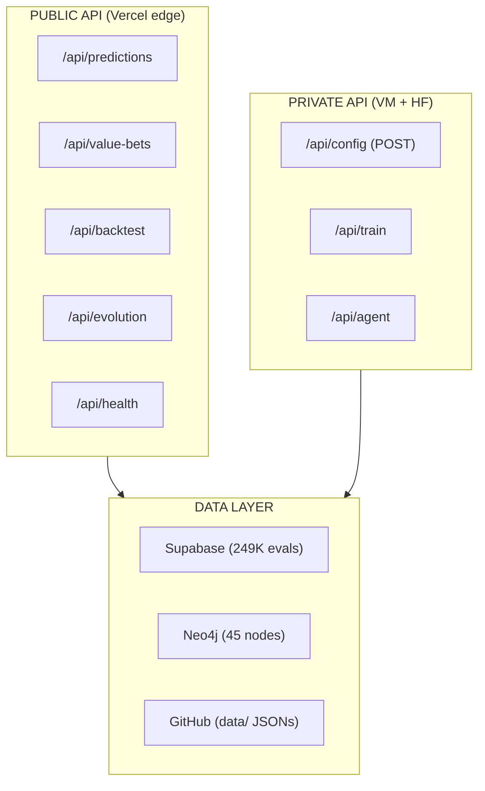

# 08 -- API Vision & Marketplace

> API-first architecture | Agent marketplace | SaaS $19/$49/$149 | Bloomberg Terminal for sports quant

---

## Vision

Nomos42 is not just a prediction engine -- it is the foundation for a **sports AI API platform**:

1. **SaaS subscriptions** -- sell predictions to individual bettors
2. **Agent packages** -- sell evolved AI traders to hedge funds (B2B)
3. **AI marketplace** -- create an agent trading ecosystem
4. **Bloomberg Terminal** -- become the terminal for sports quant

See full business plan: [[15-Business-Plan]]

---

## SaaS Pricing Tiers

| Tier | Price | Features | Target |
|------|-------|----------|--------|
| Free | $0/mo | 3 picks/week, 24h delay | Individual, testing |
| Starter | $19/mo | 10 picks/day, same-day | Casual bettor |
| Pro | $49/mo | All picks, Kelly sizing, API access | Serious bettor |
| Quant | $149/mo | Full API, backtest, model details | Quant developer |
| Institutional | Custom | White-label, dedicated island | Hedge fund / sportsbook |

---

## API Architecture



---

## Agent Marketplace

### What We Sell

| Product | Description | Price |
|---------|-------------|-------|
| Agent Packages | Pre-trained Grok/Claude/Gemini traders with full backtest | $299 one-time |
| Island Subscriptions | Dedicated HF evolution island, custom features | $5,000/mo |
| Signal API | Raw probability stream + Kelly fractions | $149/mo |
| White-label | Full platform for sportsbooks | $100K+/yr |

---

## Revenue Model

| Product | Unit Price | Volume Target | Monthly Revenue |
|---------|-----------|---------------|-----------------|
| Starter subs | $19/mo | 100 users | $1,900 |
| Pro subs | $49/mo | 50 users | $2,450 |
| Quant subs | $149/mo | 20 users | $2,980 |
| Institutional | $5,000/mo | 2 clients | $10,000 |
| Agent packages | $299 one-time | 20/mo | $5,980 |
| **Total (Year 1)** | | | **$23,310/mo** |

---

## Dashboard (Live)

URL: **nomos-dashboard.vercel.app**

| Page | Purpose | Status |
|------|---------|--------|
| `/` | Homepage hub | ACTIVE |
| `/nba` | NBA predictions, evolution status | ACTIVE |
| `/arena` | Trading Floor, 5 live charts | ACTIVE |
| `/political` | Political alpha signals | ACTIVE |
| `/infra` | Infrastructure health | ACTIVE |
| `/forge` | Department council status | ACTIVE |

Charts deployed: bankroll evolution, strategy comparison, model heatmap, evolution Brier, agent P&L.

Tech stack: Next.js + Vercel + Tailwind CSS

---

## Telegram Bot as API Gateway

@Nomos42Bot serves as the primary user interface:
- `/predict` -- today's predictions
- `/bankroll` -- current bankroll state
- `/pick [game]` -- specific game analysis
- `/evolution` -- fleet status
- `/alert on/off` -- subscribe to alerts

Channel: **@Nomos42** -- public predictions + daily summary

---

## Technical Requirements for Launch

| Requirement | Status | Blocker |
|-------------|--------|---------|
| Public prediction API | PARTIAL (Vercel) | -- |
| Authentication + rate limiting | NOT STARTED | Stripe setup |
| Stripe billing | NOT STARTED | **USER: connect Stripe** |
| User dashboard | PARTIAL | -- |
| Documentation | NOT STARTED | -- |
| Beat Brier < 0.20 | IN PROGRESS (0.21570) | GPU time |

> [!warning] Manual blocker
> Stripe account connection requires user banking info. Go to stripe.com/dashboard.

---

## Enterprise Vision ($1B)

```
Layer 1: Individual bettor SaaS ($19-149/mo)
Layer 2: Quant developer API ($149-999/mo)
Layer 3: Hedge fund institutional ($5K-50K/mo)
Layer 4: Sportsbook licensing ($100K+/yr)
Layer 5: International expansion (UK, EU, Asia)
```

**TAM analogy:** Bloomberg Terminal = $24,000/yr x 300,000 subs = $7.2B
**Sports quant niche:** 1% of that TAM = **$72M ARR**

---

## Links

[[00-Dashboard]] | [[07-Betting]] | [[09-Legal-Finance]] | [[10-Repos]] | [[14-Communication]] | [[15-Business-Plan]]
