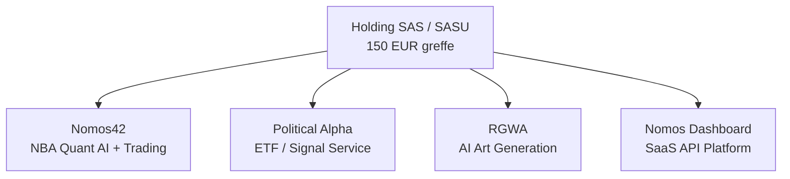

# 09 -- Legal & Finance

> Holding SASU | 150 EUR greffe | BPI Deeptech eligible | Burn rate ~20 EUR/mo | Pre-revenue

---

## Corporate Structure

**Entity type:** SASU (Societe par Actions Simplifiee Unipersonnelle)
- Recommended for single founder
- Simplest structure for tech startup in France
- **Registration cost:** ~150 EUR greffe (Tribunal de Commerce)

---

## BPI France Deeptech Program

**Target:** BPI Deeptech Innovation grant / loan

### Eligibility (Met)

| Criterion | Evidence |
|-----------|----------|
| AI/ML technology | Brier score 0.21570, measurable performance |
| Validated predictions | Walk-forward 19 weeks, 934 games |
| Active R&D loop | 18 techniques, 14 papers, 6 HF islands |
| Quantifiable IP | Feature engine v3.1-46cat, 6,253 features, TabICL |
| International market | NBA = US market, $100B+ sports betting |

**Grant range:** 30,000 - 500,000 EUR (seed) + optional loan up to 2x
**Application requirements:**
- Detailed technical dossier (Brier 0.21570 documented)
- Research paper references (Montrucchio SOTA reference)
- Market sizing (TAM = $180B global sports betting)
- 3-year financial projections

---

## Financial Tracking

### Infrastructure Costs

| Item | Cost | Frequency | Notes |
|------|------|-----------|-------|
| VM (Google Cloud) | ~$5-20/mo | Monthly | Free tier |
| HF Spaces (10) | $0 | -- | Free tier |
| Kaggle | $0 | Per session | P100 free |
| Colab | $0-$10 | On demand | T4 free tier |
| Vast.ai GPU | $0.16/hr | On demand | Burst only |
| Supabase | $0 | -- | Free tier |
| Vercel | $0 | -- | Hobby plan |
| Domain / misc | ~$10/yr | Annual | -- |
| **Total burn** | **~$20-30/mo** | Monthly | Sustainable |

### Revenue Status

| Source | Current | Target |
|--------|---------|--------|
| SaaS subscriptions | $0 | $23,310/mo (Y1) |
| First user | Pierre (test, pending) | -- |
| Stripe | NOT CONNECTED | **USER: connect** |

---

## Intellectual Property

| Asset | Description | Status |
|-------|-------------|--------|
| Feature engine v3.1-46cat | 46 categories, 6,253 NBA features | DEPLOYED |
| TabICL adaptation | In-context learning for NBA tabular data | ATR (0.21570) |
| Karpathy autoresearch loop | 5-min autonomous research cycles | RUNNING |
| Trading Floor v4 | 5-AI competition architecture | RUNNING |
| Guardian Orchestrator v3 | Cross-dept resource allocation | RUNNING |
| Political Alpha engine | 22-cat, 743-feature ETF signals | RUNNING |
| Bloomberg Terminal TUI | Rich terminal interface | DEPLOYED |

---

## $100 -> $1M Financial Model

| Year | Bankroll | Key Milestone |
|------|----------|---------------|
| 2026 | $100 -> $500 | Fix bugs, beat Brier 0.21 |
| 2026 | $500 -> $5K | 20+ bets/week, edge >5% |
| 2027 | $5K -> $50K | Brier 0.20, API launch |
| 2027 | $50K -> $500K | 100 SaaS users, institutional pilot |
| 2028 | $500K -> $1M+ | Full API, international expansion |

See detailed model: [[07-Betting]] | Business plan: [[15-Business-Plan]]

---

## Legal Compliance

### Sports Betting
- Virtual bankroll / simulation = no legal issue
- France: licensed operator (FDJ / Winamax / PMU) = legal
- US: state-by-state (legal in 30+ states)
- **API selling predictions = information service** (legal in most jurisdictions)

### Data Sources
- NBA.com/stats: public API, non-commercial research OK
- Basketball-Reference: public, attribution required
- FEC: public government data, unrestricted
- Odds data: purchased or scraped (verify terms per provider)

### Privacy / GDPR
- No personal user data collected (yet)
- When SaaS launches: GDPR-compliant handling required
- Telegram bot: no user data stored beyond session

---

## Key Accounts

| Service | Account | Status |
|---------|---------|--------|
| GitHub | LBJLincoln | ACTIVE |
| HuggingFace | LBJLincoln, LBJLincoln26, Nomos42 | ACTIVE |
| Kaggle | alexismoret6 | ACTIVE |
| Supabase | project xivvnr (pooler) | ACTIVE |
| Vercel | nomos-dashboard | ACTIVE |
| Google Drive | backup | ACTIVE |
| Tailscale | mesh network | ACTIVE |
| Neo4j | knowledge graph | ACTIVE |

---

## Links

[[00-Dashboard]] | [[08-API-Vision]] | [[07-Betting]] | [[10-Repos]] | [[15-Business-Plan]]
