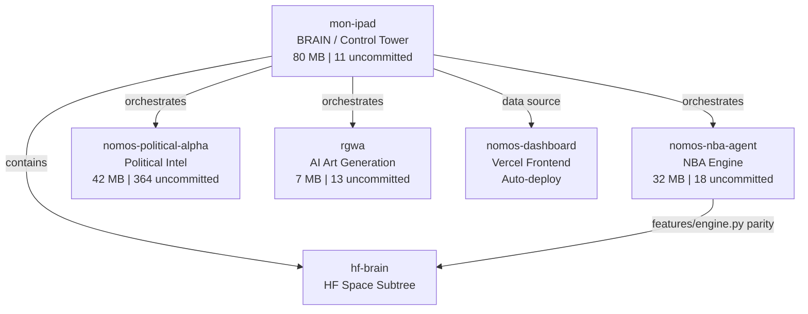

# 10 -- All Repos

> 5 active repos + 1 subtree | Cross-repo health from cross-repo-health.json | Updated: 2026-04-04T08:52Z

---

## Ecosystem Map



---

## Repo Details

### 1. mon-ipad (Brain) -- ACTIVE

| Property | Value |
|----------|-------|
| Path | `/home/termius/mon-ipad` |
| GitHub | github.com/LBJLincoln/mon-ipad |
| Last commit | `7b4384b6` -- cross-pollination S15->S14/S10 + TF docs |
| Uncommitted | 11 files |
| Size | 80 MB |

**Purpose:** Central intelligence. Cloud brain trigger, all crons, Telegram bots, department councils, Guardian Orchestrator, Trading Floor, all data files, THIS VAULT.

**Key directories:**
- `scripts/` -- all automation (kaggle, councils, agents, infra, arena, bloomberg)
- `data/` -- all JSON state files (agent-health, bankroll, departments, arena)
- `features/` -- feature engine (parity with hf-brain)
- `docs/obsidian/` -- this knowledge vault
- `logs/` -- operational logs

**Key scripts:**
- `scripts/autonomous-cycle.sh` -- main 4h cycle
- `scripts/councils/department-council.sh` -- dept Karpathy runner
- `scripts/arena/arena-engine.py` -- Trading Floor engine
- `scripts/agents/multi-brain.sh` -- cloud brain trigger
- `scripts/bloomberg/nomos42-terminal.py` -- Bloomberg TUI
- `scripts/bloomberg/bloomberg-api.py` -- HTTP API port 8042

---

### 2. nomos-nba-agent (NBA Engine) -- ACTIVE

| Property | Value |
|----------|-------|
| Path | `/home/termius/nomos-nba-agent` |
| Last commit | `ae166414` -- evolution: 4 critical fixes |
| Uncommitted | 18 files |
| Size | 32 MB |

**Purpose:** NBA prediction engine. ML training, feature engine, GA evolution, HF space code, predict_today, backtest.

**Key components:**
- `features/engine.py` -- v3.1-46cat (MUST match hf-brain)
- `hf-space/` -- deployed to all 6 islands
- `scripts/predict_today.py` -- daily predictions
- `scripts/evaluate_predictions.py` -- post-game evaluator

---

### 3. nomos-political-alpha (Political Intel) -- ACTIVE

| Property | Value |
|----------|-------|
| Path | `/home/termius/nomos-political-alpha` |
| Last commit | `a860cf3d` -- deploy consolidated_events to HF |
| Uncommitted | 364 files |
| Size | 42 MB |

> [!warning] 364 uncommitted changes
> Mostly data files. Needs cleanup commit.

**Purpose:** Political alpha signal generation. Congressional trades, FEC donors, social signals, crypto sentiment.

**Key components:**
- `ops/fetch_political_data.py` -- data fetcher (fast/full/insider/prices)
- `features/` -- v3.1 (22 categories, 743 features)
- `data/congressional/` -- insider trading signals
- HF Spaces: P1_pol + P2_pol

Details: [[17-Political-Alpha]]

---

### 4. rgwa (AI Art Generation) -- ACTIVE (idle)

| Property | Value |
|----------|-------|
| Path | `/home/termius/rgwa` |
| GitHub | github.com/LBJLincoln/rgwa |
| Last commit | `fe1f3afe` -- Add creative Karpathy loop |
| Uncommitted | 13 files |
| Size | 7 MB |

**Purpose:** AI artistic generation. @RGWAbot. Forge D8 (Creative) runs here.

Details: [[18-Creative-RGWA]]

---

### 5. nomos-dashboard (Frontend) -- ACTIVE

| Property | Value |
|----------|-------|
| Path | `/home/termius/nomos-dashboard` |
| Deployment | Vercel auto-deploy |
| Last commit | `75ca5e51` -- add 5 live charts to arena |
| Size | ~0 MB (Next.js app) |

**Purpose:** Public dashboard. Shows NBA, arena, political, infra, forge.

**Pages:** `/` hub | `/nba` predictions | `/arena` Trading Floor | `/political` | `/infra` | `/forge`

> [!warning] NEVER build on VM
> No `next build` / `tsc` on VM. Push to Vercel instead.

---

### 6. hf-brain (Subtree) -- ACTIVE

| Property | Value |
|----------|-------|
| Path | `/home/termius/mon-ipad/hf-brain` |
| Type | Subtree inside mon-ipad |
| Deploy | `git subtree push` to HF repos |

**Parity rule:** `hf-brain/features/engine.py` MUST ALWAYS equal `nomos-nba-agent/features/engine.py`

---

## Cross-Repo Health Summary

| Repo | Uncommitted | Last Activity | Status |
|------|-------------|---------------|--------|
| mon-ipad | 11 files | 2026-04-04 | ACTIVE |
| nomos-nba-agent | 18 files | 2026-04-03 | ACTIVE |
| nomos-political-alpha | 364 files | 2026-04-04 | DIRTY |
| rgwa | 13 files | 2026-04-01 | IDLE |
| nomos-dashboard | 0 files | 2026-04-04 | CLEAN |

---

## Future Repos (Planned)

| Repo | Purpose | Status |
|------|---------|--------|
| nomos-api | Public API gateway (FastAPI + auth + billing) | PLANNED |
| nomos-mobile | Mobile app (React Native) | BACKLOG |
| nomos-agent-sdk | SDK for building custom trading agents | PLANNED |

---

## Git Workflow

```bash
# Standard push
git add -p && git commit -m "data: description" && git push

# Deploy to HF Space (S10)
git subtree push --prefix=hf-brain hf-s10 main

# Cross-repo health check
python3 scripts/cross-repo-monitor.py

# Full autonomous sync
scripts/autonomous-cycle.sh
```

---

## Links

[[00-Dashboard]] | [[01-Architecture]] | [[05-Infrastructure]] | [[08-API-Vision]] | [[19-Cross-Repo]]
