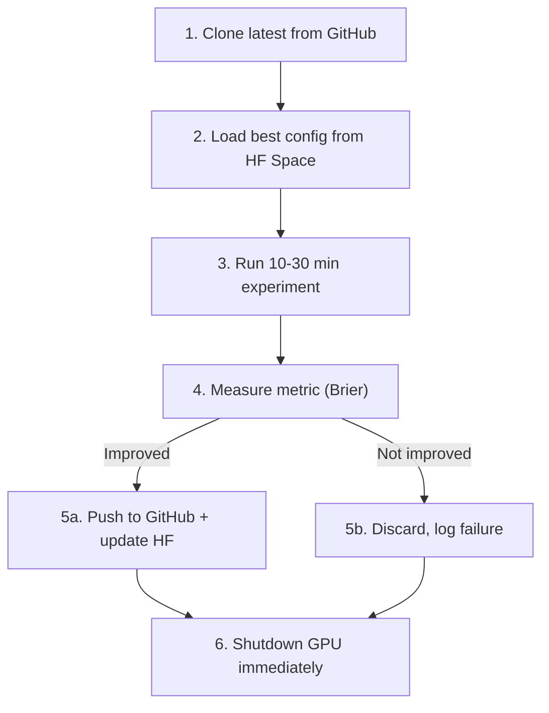

# 11 -- GPU Compute

> All GPU platforms, credits, schedules, and the burst pattern. ZERO ML on VM -- all training here.

---

## Platform Overview

| Platform | GPU | Session Limit | Cost | Best Result | Status |
|----------|-----|---------------|------|-------------|--------|
| **Colab** | T4 16GB | 30 min burst | Free / $10 Pro | ATR 0.21570 (TabICL) | CHECK CREDITS |
| **Kaggle** | P100 16GB | 9h weekly | Free | 0.21844 (gen52) | RUNNING (NBA + Political) |
| **Lightning AI** | T4/A10G | 22h total | Free tier | -- | AVAILABLE |
| **HF ZeroGPU** | H200 NVIDIA | ~5 min/day/account | Free (15 min/day x3 accounts) | -- | AVAILABLE |
| **Modal** | A10G/A100 | Serverless | $0.16/hr | -- | LAUNCHED |
| **Vast.ai** | Various | On demand | $0.16/hr | -- | AVAILABLE |
| **Laptop Ollama** | CPU (Acer Aspire 3) | Unlimited | Free | -- | LOCAL MODELS |

---

## Platform Details

### Google Colab (ATR Home)

> [!tip] Best results come from Colab T4
> TabICL ensemble achieved ATR 0.21570 here (iter 15). 318 iterations in 2h50.

| Property | Value |
|----------|-------|
| GPU | T4 16GB VRAM |
| Notebook | `colab/nba_evolution_gpu.ipynb` |
| Rate | 318 iter/2h50 (GPU mode) |
| Best Brier | 0.21570 (TabICL, iter 15) |
| Cost | Free tier / $10 Pro |

### Kaggle

| Property | Value |
|----------|-------|
| GPU | P100 16GB VRAM |
| Account | alexismoret6 |
| Session limit | 9h weekly (30h/month) |
| Scripts | `scripts/kaggle/nba_karpathy_loop.py` + `political_karpathy_loop.py` |
| Rate | 12 iter/hr, ~100/session |
| Best Brier | 0.21844 (gen52) |
| Walk-forward | 0.22447 avg (19 weeks, 934 games) |
| Status | **RUNNING** (both NBA and Political) |

Cron: `0 3 * * *` via `scripts/kaggle-gpu-evolution.sh`

### HF ZeroGPU (Free H200)

> [!info] 15 min free GPU per day across 3 accounts
> H200 NVIDIA -- the most powerful free GPU available.
> Free: ~5 min/day/account. Pro ($9/mo): 25 min/day/account.

| Account | Token | Free Minutes | Pro Minutes |
|---------|-------|-------------|-------------|
| LBJLincoln | HF_TOKEN | 5 min/day | 25 min/day ($9) |
| LBJLincoln26 | HF_TOKEN_2 | 5 min/day | 25 min/day ($9) |
| Nomos42 | HF_TOKEN_3 | 5 min/day | 25 min/day ($9) |
| **Total** | | **15 min/day** | **75 min/day** |

Script: `scripts/gpu-burst/zerogpu-burst.py`

### Lightning AI

| Property | Value |
|----------|-------|
| GPU | T4 / A10G |
| Session limit | 22h total |
| Cost | Free tier |
| Status | AVAILABLE |
| Credentials | In memory (SSH + dashboard) |

### Modal

| Property | Value |
|----------|-------|
| GPU | A10G / A100 (serverless) |
| Cost | $0.16/hr (A10G) |
| Status | LAUNCHED |
| Token | In environment |

### Laptop Ollama (Local Models)

| Property | Value |
|----------|-------|
| Hardware | Acer Aspire 3 |
| Models | Gemma 4 (2B), Qwen 3.6, Mistral |
| RAM | ~4 GB for 2B models |
| Purpose | Local monitoring, free model council |
| Script | `scripts/laptop/agent-monitor.py` |

---

## GPU Burst Pattern (Karpathy Style)

> [!warning] Budget discipline
> GPU bursts are 10-30 min MAX. Clone -> experiment -> measure -> push/discard -> shutdown.
> Never leave a GPU session running idle.

---

## Daily GPU Budget

| Slot | Platform | Duration | Purpose |
|------|----------|----------|---------|
| Night (03:00) | Kaggle | 9h | Karpathy NBA + Political loops |
| On-demand | Colab | 30 min | TabICL experiments |
| On-demand | ZeroGPU | 15 min (3x5) | Quick validation |
| On-demand | Modal | 10 min | Fast experiment |
| On-demand | Lightning | 22h cap | Extended runs |

---

## Karpathy Loop Scripts

| Script | Platform | Purpose |
|--------|----------|---------|
| `scripts/kaggle/nba_karpathy_loop.py` | Kaggle P100 | NBA evolution (seeds from 6 islands) |
| `scripts/kaggle/political_karpathy_loop.py` | Kaggle P100 | Political alpha evolution |
| `scripts/gpu-burst/zerogpu-burst.py` | HF ZeroGPU H200 | Quick GPU validation |
| `colab/nba_evolution_gpu.ipynb` | Colab T4 | TabICL + tree ensemble |

---

## Links

[[00-Dashboard]] | [[02-Evolution]] | [[05-Infrastructure]] | [[16-Karpathy-Pattern]] | [[06-Research]]
