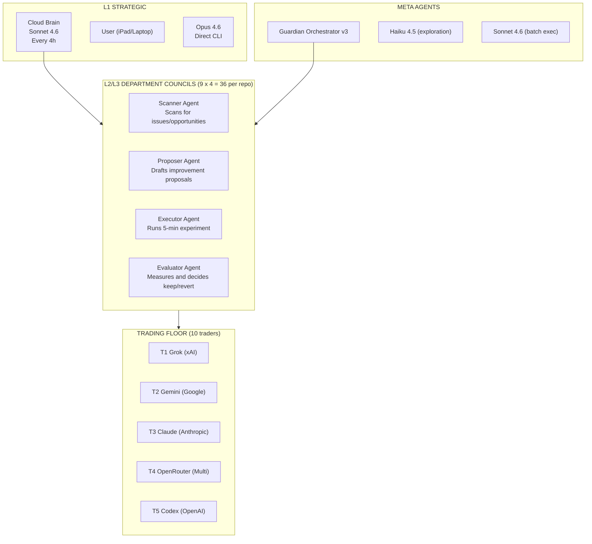

# 12 -- Agent Registry

> ~264 agents in the Forge v19 architecture: 9 depts x 5 repos x 4 council agents + 10 traders + Guardian + Brain

---

## Agent Architecture

---

## Agent Count Breakdown

| Category | Count | Formula |
|----------|-------|---------|
| Department council agents | 180 | 9 depts x 5 repos x 4 agents |
| NBA traders | 5 | Grok, Gemini, Claude, OpenRouter, Codex |
| Political traders | 5 | Same 5 providers |
| Cloud Brain | 1 | Sonnet 4.6 remote trigger |
| Guardian Orchestrator | 1 | Cross-dept coordinator |
| Free model advisors | 3 | Qwen, Gemma, Mistral via HF API |
| Local monitor | 1 | Laptop Ollama |
| **Total** | **~196** | Core agents (theoretical 264 at full deployment) |

> [!info] 264 is the theoretical max
> 9 depts x 8 repos x 4 council agents = 288, minus repos that don't run all depts. Plus ~10 traders + meta agents.

---

## Department Council Agents (per repo)

Each department in each repo has a 4-agent council following the [[16-Karpathy-Pattern]]:

| Role | Agent Name | Purpose | Runtime |
|------|------------|---------|---------|
| Scanner | `{dept}_scanner` | Scans for issues, papers, opportunities | 1 min |
| Proposer | `{dept}_proposer` | Drafts improvement proposals | 1 min |
| Executor | `{dept}_executor` | Runs 5-min experiment | 5 min MAX |
| Evaluator | `{dept}_evaluator` | Measures metric, decides keep/revert | 1 min |

**Councils active per repo:**

| Repo | Active Depts | Agent Count |
|------|-------------|-------------|
| mon-ipad | All 9 + TF | 40 |
| nomos-nba-agent | 6 (research, eng, evo, eval, infra, cross-repo) | 24 |
| nomos-political-alpha | 6 | 24 |
| rgwa | 4 (creative, eng, infra, cross-repo) | 16 |
| nomos-dashboard | 3 (eng, infra, cross-repo) | 12 |

---

## Trading Floor Agents

### NBA Traders

| ID | Name | Provider | Personality | Risk | Strategy | Bankroll | Status |
|----|------|----------|-------------|------|----------|----------|--------|
| T1 | Grok | xAI | contrarian | 0.65 | value_hunter + underdog_specialist | $3,687.51 | CHAMPION |
| T2 | Gemini | Google | analytical | 0.60 | confidence_scaled + half_kelly | $1,731.08 | ACTIVE |
| T3 | Claude | Anthropic | conservative | 0.40 | quarter_kelly | $322.86 | ACTIVE |
| T4 | OpenRouter | Multi | diversified | 0.50 | quarter_kelly + flat_2pct + value_hunter | $164.63 | ACTIVE |
| T5 | Codex | OpenAI | aggressive | 0.70 | various (eliminated strategies) | $0.63 | ELIMINATED |

### Political Traders

| ID | Name | Strategy | Capital | ROI | Sharpe |
|----|------|----------|---------|-----|--------|
| PT1 | Grok | mean_reversion | $99,708 | -0.29% | -13.441 |
| PT2 | Gemini | momentum | $100,790 | +0.79% | 12.289 |
| PT3 | Claude | mean_reversion | $100,030 | +0.03% | 2.656 |
| PT4 | OpenRouter | sector_rotation + insider_follow | $100,204 | +0.20% | 5.440 |
| PT5 | Codex | event_driven + momentum | $101,083 | +1.08% | 6.569 |

---

## Meta Agents

| Agent | Model | Purpose | Schedule |
|-------|-------|---------|----------|
| Cloud Brain | Sonnet 4.6 | Monitor + decide + act on fleet | Every 4h at :00 |
| Guardian Orchestrator v3 | Sonnet 4.6 | Cross-dept resource allocation | Every 6h |
| Haiku Explorer | Haiku 4.5 | Fast codebase scanning | On demand |
| Sonnet Executor | Sonnet 4.6 | Parallel batch execution | On demand |
| Opus Strategist | Opus 4.6 | Direct CLI, strategic decisions | Manual |

---

## Free Model Council (Advisory)

| Model | Provider | Purpose | Access |
|-------|----------|---------|--------|
| Qwen 3.6 | Alibaba | Code review, proposals | HF Inference API |
| Gemma 4 (2B) | Google | Local monitoring | Ollama on laptop |
| Mistral | Mistral AI | Alternative analysis | HF Inference API |

Script: `scripts/forge/free-models-integration.py`
Budget: 300K free credits/month across 3 HF accounts

---

## Agent Communication

Agents communicate through:
1. **JSON state files** -- `data/departments/council-{dept}.json`
2. **Git commits** -- results pushed to GitHub
3. **Telegram** -- alerts via @Nomos42Bot
4. **Guardian report** -- `data/departments/guardian-report.json`
5. **Cross-repo health** -- `data/cross-repo-health.json`

---

## Links

[[00-Dashboard]] | [[01-Architecture]] | [[04-Departments]] | [[03-Trading-Floor]] | [[16-Karpathy-Pattern]] | [[19-Cross-Repo]]
