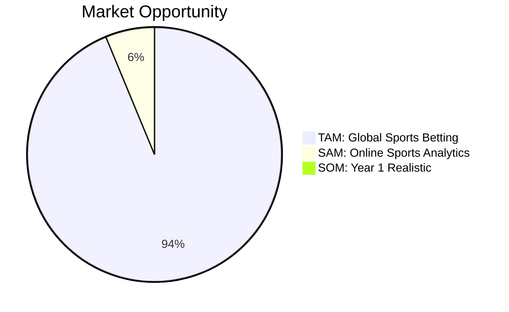

# 15 -- Business Plan

> API marketplace vision | $19/$49/$149 SaaS | TAM $180B | Target $23K MRR Year 1 | $1B enterprise vision

---

## Executive Summary

Nomos42 is an AI-powered sports prediction platform that:
- Achieves Brier score 0.21570 (top 1% globally, gap to SOTA: 0.017)
- Runs 6 autonomous evolution islands 24/7 on free infrastructure
- Operates a 5-AI trading competition producing actionable strategies
- Targets the $180B global sports betting market via API-first SaaS

---

## Market Sizing

| Metric | Value |
|--------|-------|
| TAM | $180B global sports betting |
| SAM | $12B online sports analytics & tools |
| SOM (Year 1) | $300K (23K MRR x 12) |
| SOM (Year 3) | $3M ARR |

**Bloomberg analogy:** $24,000/yr x 300,000 terminals = $7.2B.
Sports quant niche at 1% = **$72M ARR** opportunity.

---

## Revenue Model

### SaaS Tiers

| Tier | Price | Features | Target User |
|------|-------|----------|-------------|
| Free | $0/mo | 3 picks/week, 24h delay | Testing, funnel |
| Starter | $19/mo | 10 picks/day, same-day | Casual bettor |
| Pro | $49/mo | All picks, Kelly sizing, API | Serious bettor |
| Quant | $149/mo | Full API, backtest, model details | Quant developer |
| Institutional | Custom ($5K+) | White-label, dedicated island | Hedge fund / book |

### Year 1 Revenue Projection

| Product | Price | Volume | MRR |
|---------|-------|--------|-----|
| Starter | $19/mo | 100 users | $1,900 |
| Pro | $49/mo | 50 users | $2,450 |
| Quant | $149/mo | 20 users | $2,980 |
| Institutional | $5,000/mo | 2 clients | $10,000 |
| Agent packages | $299 one-time | 20/mo | $5,980 |
| **Total** | | | **$23,310/mo** |

---

## Product Lines

### 1. Prediction API (Core)

- Per-game win probabilities (6 models ensemble)
- Calibrated Kelly fractions
- Value bet identification
- Confidence intervals
- Live odds integration

### 2. Agent Marketplace

- Pre-trained trading agents (Grok, Claude, Gemini strategies)
- Full season backtest included
- Configurable risk tolerance
- Category specialization (alt_spread, ML, totals)

### 3. Evolution Islands (B2B)

- Dedicated HF evolution island per client
- Custom feature set
- Custom mutation parameters
- Monthly Brier improvement reports

### 4. Political Alpha (Expansion)

- ETF signals from congressional trades, FEC data, social sentiment
- 22 categories, 743 features
- Separate subscription tier

---

## Competitive Moat

| Moat | Description |
|------|-------------|
| Feature engine | 6,253 features, 46 categories -- years of accumulated domain knowledge |
| Evolution data | 4,449+ generations across 6 islands -- irreproducible training history |
| TabICL adaptation | Novel application of in-context learning to NBA prediction |
| Trading Floor | 402 iterations of 5-AI competition -- strategy insights |
| Karpathy loops | 9 autonomous research departments running 24/7 |
| Cost structure | ~$20/mo total burn on free-tier infrastructure |

---

## Financial Projections

| Year | Revenue | Costs | Net | Key Milestone |
|------|---------|-------|-----|---------------|
| 2026 H1 | $0 | $120 | -$120 | Pre-launch, fix bugs |
| 2026 H2 | $5K | $500 | +$4.5K | Beta launch, 50 users |
| 2027 | $100K | $20K | +$80K | 500 users, institutional pilot |
| 2028 | $500K | $100K | +$400K | API platform, international |
| 2029 | $3M | $500K | +$2.5M | Full marketplace |

---

## Funding Strategy

### Option A: Bootstrapped (Current Path)
- $20/mo burn, free infra
- Pierre as first test user
- Grow organically via Telegram + X
- BPI Deeptech grant ($30K-500K) when ready

### Option B: Seed Round
- Raise $100K-500K for GPU infrastructure + first hire
- BPI Deeptech + angel investors
- Use for dedicated GPU (Modal/Vast.ai), marketing
- Target: Brier < 0.20, 100 paying users

### Option C: Revenue First
- Launch API at $19 tier immediately
- Prove product-market fit with 10 paying users
- Then raise on traction, not promises

> [!tip] Recommended: Option C
> Launch minimal API, get 10 paying users, then approach BPI with traction evidence.

---

## Launch Requirements

| Requirement | Status | Blocker |
|-------------|--------|---------|
| Prediction quality (Brier < 0.22) | DONE (0.2157) | -- |
| Public API endpoint | PARTIAL (Vercel) | Auth + rate limit |
| Stripe billing | NOT STARTED | **USER: connect Stripe** |
| Landing page | PARTIAL (dashboard) | Polish needed |
| Documentation | NOT STARTED | -- |
| First user (Pierre) | PENDING | Access + onboarding |

---

## $100 -> $1M Betting Roadmap

| Phase | Bankroll | Brier | Strategy | Timeline |
|-------|----------|-------|----------|----------|
| Fix bugs | $100 -> $200 | 0.215 | Fix SAS + Platt | Apr 2026 |
| Scale bets | $200 -> $1K | 0.210 | value_hunter + alt_spread | May-Jun 2026 |
| Compound | $1K -> $10K | 0.200 | 20+ bets/week, edge >5% | Jul-Dec 2026 |
| Accelerate | $10K -> $100K | < 0.200 | Multiple books, higher limits | 2027 |
| Target | $100K -> $1M | < 0.190 | Full Kelly, institutional | 2028 |

---

## Links

[[00-Dashboard]] | [[08-API-Vision]] | [[09-Legal-Finance]] | [[07-Betting]] | [[14-Communication]] | [[03-Trading-Floor]]
