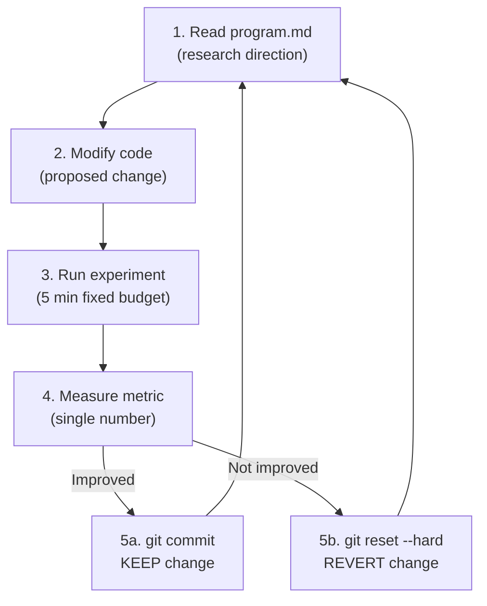
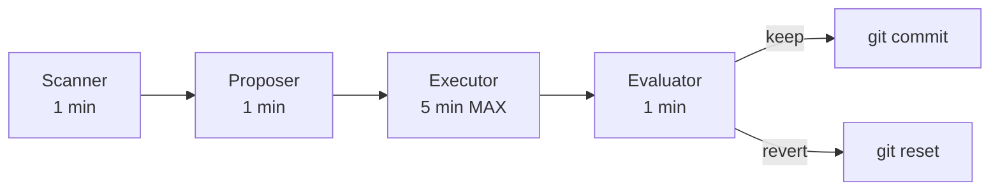

# 16 -- Karpathy Autoresearch Pattern

> The core methodology behind all 9 departments. 5-minute loops, single-metric optimization, keep/revert discipline.
> Source: github.com/karpathy/autoresearch

---

## The Pattern



### Key Principles

1. **Single metric** -- each loop optimizes exactly ONE number
2. **5-minute budget** -- experiments never run longer than 5 minutes
3. **Binary outcome** -- keep or revert, no "maybe"
4. **Automatic** -- 12 experiments/hour, ~100 overnight
5. **3-file architecture** -- `program.md` (direction) + `run.py` (experiment) + `log.jsonl` (results)

---

## Our Adaptation

Karpathy's original pattern is designed for research papers. We adapt it for 9 departments across 5 repos:

| Component | Karpathy Original | Nomos42 Adaptation |
|-----------|-------------------|-------------------|
| Direction file | `program.md` | `council-{dept}.json` |
| Experiment | `run.py` | `department-council.sh {dept}` |
| Log | `log.jsonl` | `data/departments/{dept}/metrics.jsonl` |
| Metric | Paper quality score | Brier, ROI, uptime, etc. |
| Budget | 5 min | 5 min |
| Runner | Manual | Cron (hourly to daily per dept) |
| Council | Single agent | 4 agents (scanner, proposer, executor, evaluator) |

---

## Department-Specific Loops

| Dept | SCAN | PROPOSE | EXECUTE (5 min) | EVALUATE | Metric |
|------|------|---------|------------------|----------|--------|
| D1 Research | Scan ArXiv, GitHub | Draft technique proposal | Quick literature survey | Papers found, relevance | papers/week |
| D2 Engineering | Check Brier drift | Code change proposal | Run test suite | Brier delta | Brier score |
| D3 Evolution | Check fleet status | GA parameter tweak | Evaluate island health | Stagnation, diversity | gen/hr, Brier |
| D4 Evaluation | Audit predictions | Bias detection | Run calibration check | ECE, FP rate | calibration |
| D5 Betting | Check ROI trend | Strategy adjustment | Backtest simulation | ROI delta | ROI % |
| D6 Infra | System health scan | Fix proposal | Apply fix + verify | Uptime, RAM, disk | uptime % |
| D7 Political | Scan political signals | Feature proposal | Quick feature test | Political Brier | Brier score |
| D8 Creative | Quality audit | Generation proposal | Generate + score | Quality score | pieces/day |
| D9 Cross-Repo | Parity check | Sync proposal | Cross-repo sync | Parity score | diff count |

---

## Council Structure (4 Agents per Dept)



| Agent | Role | Time Budget | Output |
|-------|------|-------------|--------|
| Scanner | Find issues, opportunities | 1 min | Issue list |
| Proposer | Draft improvement proposal | 1 min | Proposal + expected delta |
| Executor | Run the experiment | 5 min MAX | Results |
| Evaluator | Measure metric, decide | 1 min | keep/revert decision |

---

## Implementation

### Runner Script

```bash
# Run single department loop
scripts/councils/department-council.sh <dept>

# Run across all repos
scripts/councils/cross-repo-councils.sh

# Cron schedule (example: D1 Research every hour at :02)
2 * * * * /path/to/department-council.sh research
```

### State File Format

```json
{
  "dept": "engineering",
  "repo": "mon-ipad",
  "iteration": 6,
  "best_metric": null,
  "last_run": "2026-04-04T09:12:04Z",
  "history": [
    {
      "iteration": 6,
      "ts": "2026-04-04T09:12:04Z",
      "proposal": "Brier 0.2157 healthy -- monitor for drift",
      "result": "keep",
      "metrics": { "brier": { "value": 0.2157 } }
    }
  ]
}
```

---

## Guardian Integration

The Guardian Orchestrator v3 reads ALL department council outputs and:
1. Identifies **wins** (improvements) from any department
2. **Cross-pollinates** wins to other departments that could benefit
3. **Allocates resources** (GPU time, priority) based on progress
4. **Detects stagnation** and suggests interventions

Report: `data/departments/guardian-report.json`

---

## Performance Numbers

| Platform | Loop Rate | Daily Capacity |
|----------|-----------|----------------|
| VM cron (per dept) | 1-24 per day | ~100 dept-iterations/day |
| Kaggle GPU | 12 iter/hr | ~100/session (9h) |
| Colab TabICL | 318 iter/2h50 | ~150/session |
| HF Spaces | Continuous | Thousands of generations/day |

---

## Inspirations

| Source | Contribution |
|--------|-------------|
| [Karpathy autoresearch](https://github.com/karpathy/autoresearch) | Core 5-min loop pattern |
| [Paperclip](https://github.com/paperclipai/paperclip) | Org chart for AI companies |
| [Conway (Anthropic)](https://www.testingcatalog.com/exclusive-anthropic-tests-its-own-always-on-conway-agent/) | Always-on agent with webhooks |
| [Hermes Agent](https://github.com/nousresearch/hermes-agent) | Swarm agent patterns |

---

## Links

[[00-Dashboard]] | [[01-Architecture]] | [[04-Departments]] | [[12-Agent-Registry]] | [[02-Evolution]] | [[11-GPU-Compute]]
