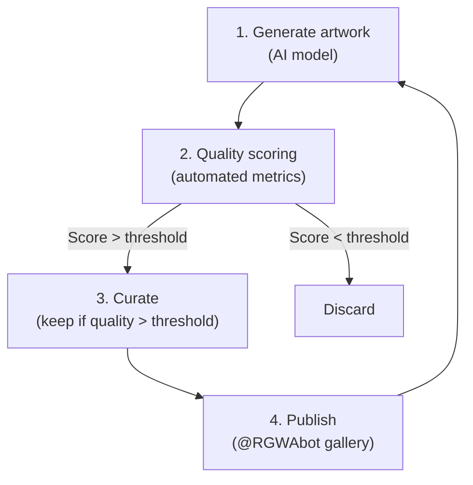

# 18 -- Creative (RGWA)

> AI artistic generation | @RGWAbot | D8 Creative dept | Status: IDLE (needs first generation run)

---

## Overview

RGWA (Really Good Web Art) is the AI artistic generation arm of the Nomos42 ecosystem. It uses generative AI to create, score, and curate artwork.

| Property | Value |
|----------|-------|
| Repo | `/home/termius/rgwa` |
| GitHub | github.com/LBJLincoln/rgwa |
| Bot | @RGWAbot (Telegram) |
| Status | IDLE -- 4 Karpathy iterations, 0 pieces generated |
| Last commit | `fe1f3afe` -- Add creative Karpathy loop |

---

## Karpathy Loop (D8 Creative)

**Pattern:** generate -> quality -> curate -> publish

| Property | Value |
|----------|-------|
| Dept | D8 Creative |
| Cron | `0 9,21 * * *` |
| Iterations | 4 (all idle) |
| Quality score | null (no pieces generated) |
| Pieces/day | 0 |

---

## Planned HF Spaces

After cleaning up dead spaces from LBJLincoln account:
- **RGWA gen-1** -- primary generation space
- **RGWA gen-2** -- experimental styles

These will run on the LBJLincoln HF account (currently has 3 dead spaces to delete).

---

## Bot Commands (@RGWAbot)

| Command | Purpose |
|---------|---------|
| `/generate` | Generate new artwork |
| `/gallery` | Browse the gallery |
| `/quality` | View quality scores |
| `/style [name]` | Set generation style |

---

## Integration with Ecosystem

| Connection | Purpose |
|------------|---------|
| D8 council | Autonomous generation loop |
| @RGWAbot | User-facing interface |
| nomos-dashboard `/rgwa` | Gallery page on dashboard |
| Guardian | Cross-pollination of quality metrics |

---

## Status

> [!info] RGWA is idle and needs activation
> The creative Karpathy loop is defined but has not produced any artwork yet.
> Next step: configure generation model and run first batch.

---

## Links

[[00-Dashboard]] | [[04-Departments]] | [[10-Repos]] | [[14-Communication]] | [[12-Agent-Registry]]
