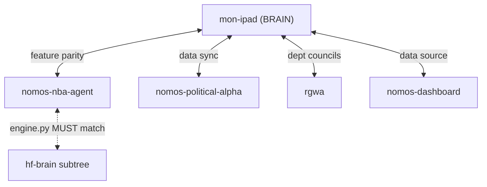
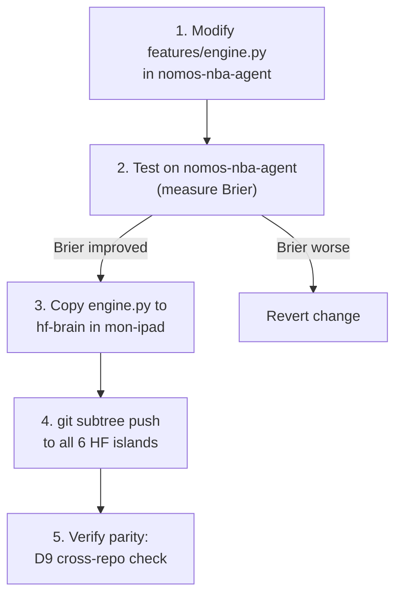

# 19 -- Cross-Repo (D9)

> D9 Cross-Repo department | 5 repos to sync | Feature parity enforcement | Cross-pollination of wins

---

## Overview

D9 Cross-Repo is responsible for keeping all 5 repos in sync, enforcing feature parity, and cross-pollinating improvements across the ecosystem.

---

## Cross-Repo Health (Live from cross-repo-health.json)

| Repo | Type | Uncommitted | Last Commit | Last Activity | Status |
|------|------|-------------|-------------|---------------|--------|
| mon-ipad | brain | 11 | `7b4384b6` | 2026-04-04 | ACTIVE |
| nomos-nba-agent | engine | 18 | `ae166414` | 2026-04-03 | ACTIVE |
| nomos-political-alpha | engine | 364 | `a860cf3d` | 2026-04-04 | DIRTY |
| rgwa | creative | 13 | `fe1f3afe` | 2026-04-01 | IDLE |
| nomos-dashboard | dashboard | 0 | -- | 2026-04-04 | CLEAN |

> [!warning] nomos-political-alpha has 364 uncommitted changes
> Mostly data files. Needs a bulk commit or selective gitignore cleanup.

---

## Parity Rules

### Critical Parity (Must Always Match)

| File | Source | Target | Status |
|------|--------|--------|--------|
| `features/engine.py` | nomos-nba-agent | hf-brain (mon-ipad subtree) | ENFORCE |
| `CLAUDE.md` | mon-ipad | all repos (adapted) | SYNC |
| Department council schema | mon-ipad | all repos | SYNC |

### Shared Resources

| Resource | Location | Shared By |
|----------|----------|-----------|
| VM (Google Cloud) | 1 vCPU, 969 MB | All repos |
| GitHub accounts | LBJLincoln | All repos |
| HF accounts (3) | Nomos42, LBJLincoln, LBJLincoln26 | All repos |
| Supabase | xivvnr pooler | NBA + Political |
| Neo4j | Knowledge graph | All repos |
| Tailscale mesh | VM + Laptop + iPad | All repos |
| Google Drive | Backup | All repos |

---

## Cross-Pollination Routes

The Guardian Orchestrator identifies wins in one department/repo and propagates them:

| Source | Target | Type | Example |
|--------|--------|------|---------|
| D3 Evolution | D3 Evolution | Island cross-pollination | S15 config -> S10 |
| D4 Evaluation | D2 Engineering | Bug fix proposals | Phantom game guard |
| D1 Research | D2 Engineering | Technique implementation | Platt scaling |
| D5 Betting | D3 Evolution | Strategy insights | value_hunter strategy |
| D7 Political | D1 Research | Feature ideas | Sentiment features |

---

## Sync Tools

| Script | Purpose | Schedule |
|--------|---------|----------|
| `scripts/cross-repo-monitor.py` | Health check all repos | `0 */2 * * *` |
| `scripts/councils/cross-repo-councils.sh` | Run dept councils across repos | Custom |
| `scripts/agents/cross-pollinate.py` | Weekly island cross-pollination | `0 4 * * 0` |
| `git subtree push` | Deploy hf-brain to HF spaces | Manual |

---

## Department Councils per Repo

Each repo runs a subset of the 9 departments:

| Dept | mon-ipad | nomos-nba-agent | nomos-political-alpha | rgwa | nomos-dashboard |
|------|----------|-----------------|----------------------|------|-----------------|
| D1 Research | Y | Y | Y | -- | -- |
| D2 Engineering | Y | Y | Y | Y | Y |
| D3 Evolution | Y | Y | Y | -- | -- |
| D4 Evaluation | Y | Y | -- | -- | -- |
| D5 Betting | Y | -- | -- | -- | -- |
| D6 Infra | Y | Y | Y | Y | Y |
| D7 Political | -- | -- | Y | -- | -- |
| D8 Creative | -- | -- | -- | Y | -- |
| D9 Cross-Repo | Y | Y | Y | Y | Y |

---

## Workflow: Deploying a Feature Engine Update

---

## Links

[[00-Dashboard]] | [[01-Architecture]] | [[04-Departments]] | [[10-Repos]] | [[12-Agent-Registry]] | [[02-Evolution]]
