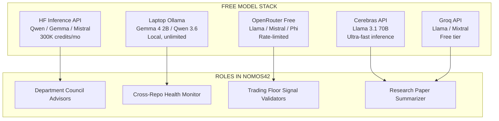

# 21 -- Free Models & Inference Stack

> Cerebras / Groq / OpenRouter / HF Inference API | 300K+ free tokens/month | Advisory council roles
> Links: [[12-Agent-Registry]] | [[05-Infrastructure]] | [[13-Tools]]

---

## Overview

Nomos42 uses a layered free-model stack to supplement the core Claude Code CLI (Opus/Sonnet/Haiku) for advisory, monitoring, and batch tasks. Zero paid API budget allocated here -- all free.



---

## Platform Breakdown

### HF Inference API (Primary)

| Property | Value |
|----------|-------|
| Accounts | LBJLincoln (HF_TOKEN) + LBJLincoln26 (HF_TOKEN_2) + Nomos42 (HF_TOKEN_3) |
| Credits | ~100K/month per account = **300K total** |
| Models | Qwen2.5-72B, Gemma 2 9B, Mistral 7B, Mixtral 8x7B |
| Integration | `scripts/forge/free-models-integration.py` |
| Purpose | Department council advisors, alternative analysis |

```python
# Usage pattern (scripts/forge/free-models-integration.py)
from huggingface_hub import InferenceClient
client = InferenceClient(token=os.getenv("HF_TOKEN_2"))
response = client.text_generation(
    "Analyze this trading strategy: ...",
    model="Qwen/Qwen2.5-72B-Instruct",
    max_new_tokens=512
)
```

### Laptop Ollama (Local, Unlimited)

| Property | Value |
|----------|-------|
| Hardware | Acer Aspire 3 (4 GB RAM allocated) |
| Models available | Gemma 4 2B, Qwen3 3.6B, Mistral 7B (4-bit) |
| Latency | ~2-5s per response (CPU inference) |
| Purpose | Cross-repo monitoring, local analysis |
| Script | `scripts/laptop/agent-monitor.py` |
| Access | Via Tailscale mesh (VM -> Laptop) |

> [!tip] Best for monitoring tasks
> Ollama on laptop is great for summarizing JSON state files and generating health reports.
> It runs 24/7 since laptop is always-on.

### Cerebras API (Ultra-Fast Free Tier)

| Property | Value |
|----------|-------|
| GPU | CS-3 wafer-scale chip |
| Models | Llama 3.1 8B, Llama 3.1 70B |
| Speed | 2,000+ tokens/second (10x faster than GPU) |
| Free tier | 1M tokens/month |
| Best for | Rapid proposal generation, quick scoring |

```bash
export CEREBRAS_API_KEY=xxx
curl https://api.cerebras.ai/v1/chat/completions \
  -H "Authorization: Bearer $CEREBRAS_API_KEY" \
  -d '{"model":"llama3.1-70b","messages":[{"role":"user","content":"..."}]}'
```

### Groq API (Fast Free Tier)

| Property | Value |
|----------|-------|
| Models | Llama 3.1 8B/70B, Mixtral 8x7B |
| Free tier | 14,400 requests/day (roughly 1M tokens) |
| Latency | ~200ms for most requests |
| Best for | Batch research queries, council scanning |

### OpenRouter (Multi-Model Free Routing)

| Property | Value |
|----------|-------|
| Free models | Llama 3.1 8B, Phi-3, Gemma 3 12B |
| Rate limits | Varies per model (~20 req/min free) |
| Use in TF | OpenRouter *trader* uses this for decisions |
| Best for | Model comparison, ensemble opinions |

---

## Model Roles in Nomos42

| Model | Platform | Role | Council |
|-------|----------|------|---------|
| Qwen2.5-72B | HF API | Primary advisor | D1 Research, D2 Engineering |
| Gemma 4 2B | Ollama laptop | Health monitor | D6 Infra, D9 Cross-Repo |
| Mistral 7B | HF API | Code reviewer | D2 Engineering |
| Llama 3.1 70B | Cerebras | Fast proposals | D4 Evaluation, D5 Betting |
| Mixtral 8x7B | Groq | Batch queries | D1 Research |
| OpenRouter mix | OpenRouter | Trading Floor T4 | Trading Floor |

---

## Budget Summary

| Source | Tokens/Month | Cost | Status |
|--------|-------------|------|--------|
| HF Inference x3 accounts | ~300K | $0 | ACTIVE |
| Ollama (laptop) | Unlimited | $0 | ACTIVE |
| Cerebras | 1M | $0 | AVAILABLE |
| Groq | ~1M | $0 | AVAILABLE |
| OpenRouter (free models) | ~500K | $0 | ACTIVE (TF) |
| **Total** | **2.8M+** | **$0** | -- |

---

## Integration Script

`scripts/forge/free-models-integration.py` handles:
1. Round-robin across 3 HF accounts (rate limit management)
2. Fallback: HF -> Groq -> Cerebras -> Ollama
3. JSON output format for council consumption
4. Token counting and budget tracking

---

## Future: Free Model Council Upgrade

Planned upgrade path for advisory council:
1. **Phase 1 (now):** Advisory-only, no code execution
2. **Phase 2:** Free models propose changes -> Claude executes
3. **Phase 3:** Free models run their own 5-min Karpathy loops (cheaply)
4. **Phase 4:** Full free-model swarm for overnight batch work

---

## Links

[[12-Agent-Registry]] | [[05-Infrastructure]] | [[13-Tools]] | [[04-Departments]] | [[22-Compute-Mesh]]
