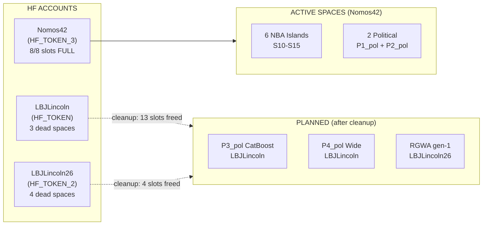
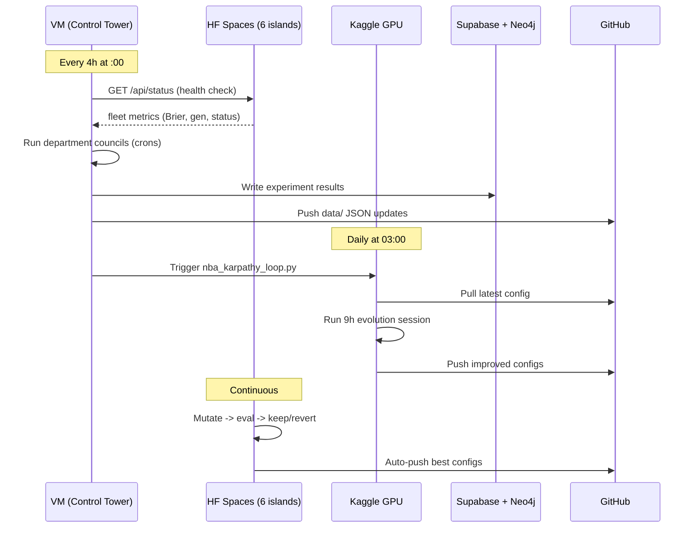

# 22 -- Compute Mesh Topology

> VM + Laptop + iPad + Brother's PC + 6 HF Spaces + Kaggle + Colab | Tailscale mesh | Updated: 2026-04-04
> Source of truth: `data/compute-inventory.json`
> Links: [[05-Infrastructure]] | [[11-GPU-Compute]] | [[21-Free-Models]]

---

## Full Topology

```mermaid
graph TD
    subgraph Local["LOCAL MESH (Tailscale)"]
        VM["VM (Google Cloud)<br/>1 vCPU / 969 MB RAM<br/>Control Tower + Crons<br/>IP: 100.x.x.x (Tailscale)"]
        Laptop["Laptop (Acer Aspire 3)<br/>Windows/WSL2<br/>Claude Code Desktop<br/>Ollama 4B models"]
        iPad["iPad (Termius)<br/>SSH terminal to VM<br/>Pilot Interface"]
        Brother["Brother's PC<br/>Windows, Termius<br/>3rd Compute Node<br/>Status: PENDING SSH"]
    end

    subgraph Cloud["CLOUD COMPUTE (Free Tier)"]
        subgraph HF["HF SPACES (8 total)"]
            S10["S10 Exploitation<br/>Nomos42/nba-quant<br/>Brier 0.22454"]
            S11["S11 Exploration<br/>Nomos42/nba-quant-2<br/>Brier 0.22273"]
            S12["S12 Extra Trees<br/>Nomos42/nba-evo-3<br/>Brier 0.22506"]
            S13["S13 CatBoost<br/>Nomos42/nba-evo-4<br/>Brier 0.22455"]
            S14["S14 LightGBM<br/>Nomos42/nba-evo-5<br/>Brier 0.22666"]
            S15["S15 Wide Search<br/>Nomos42/nba-evo-6<br/>Brier 0.22159 BEST"]
            P1["P1_pol Political<br/>Brier 0.24997"]
            P2["P2_pol Political<br/>Brier 0.23134"]
        end
        Kaggle["Kaggle (alexismoret6)<br/>P100 16GB / 9h weekly<br/>NBA + Political Karpathy"]
        Colab["Google Colab<br/>T4 16GB / 30min<br/>TabICL ATR 0.21570"]
        Lightning["Lightning AI<br/>T4/A10G / 22h total<br/>Extended runs"]
        Modal["Modal<br/>A10G serverless<br/>$0.16/hr burst"]
        ZeroGPU["HF ZeroGPU<br/>H200 / 15min/day<br/>3 accounts x 5min"]
    end

    subgraph Services["EXTERNAL SERVICES"]
        Supabase["Supabase (xivvnr)<br/>NBA data, experiments<br/>pooler connection"]
        Neo4j["Neo4j<br/>Knowledge graph<br/>45 nodes"]
        GitHub["GitHub (LBJLincoln)<br/>Source of truth<br/>5 active repos"]
        Vercel["Vercel<br/>nomos-dashboard<br/>Auto-deploy"]
        GDrive["Google Drive<br/>Daily backups<br/>03:00 cron"]
        Telegram["Telegram<br/>@Nomos42Bot<br/>@RGWAbot"]
    end

    VM -->|"subtree push"| S10
    VM -->|"subtree push"| S11
    VM -->|"subtree push"| S12
    VM -->|"subtree push"| S13
    VM -->|"subtree push"| S14
    VM -->|"subtree push"| S15
    VM -->|"kaggle-gpu-evolution.sh"| Kaggle
    VM -->|"git push"| GitHub
    VM -->|"read/write"| Supabase
    VM -->|"knowledge"| Neo4j
    GitHub -->|"auto-deploy"| Vercel
    VM -->|"backup"| GDrive
    VM -->|"alerts"| Telegram
    Laptop -->|"Tailscale"| VM
    iPad -->|"Tailscale SSH"| VM
    Brother -.->|"Tailscale (pending)"| VM
```



---

## Node Specifications

### VM (Google Cloud) -- Control Tower

| Property | Value |
|----------|-------|
| Provider | Google Cloud (free tier E2-micro) |
| CPU | 1 vCPU |
| RAM | 969 MB (CRITICAL: ZERO ML here) |
| Disk | ~10 GB (73.4% used, ~2.7 GB free) |
| OS | Ubuntu 22.04 LTS |
| Tailscale IP | 100.x.x.x |
| Crons | 36 total (see [[05-Infrastructure]]) |
| Purpose | Brain, crons, Telegram bots, Trading Floor, Git |

> [!warning] VM is RAM-constrained
> 170-211 MB free. NEVER run ML training, `next build`, or heavy processes here.

### Laptop (Acer Aspire 3) -- Local AI

| Property | Value |
|----------|-------|
| OS | Windows 11 + WSL2 (Ubuntu) |
| RAM | ~8 GB (4 GB allocated to Ollama) |
| Models | Gemma 4 2B, Qwen3 3.6B (4-bit quantized) |
| Tools | Claude Code Desktop, Ollama |
| Tailscale IP | 100.x.x.x |
| Script | `scripts/laptop/agent-monitor.py` |
| Purpose | Local model inference, monitoring, dev work |

### iPad -- Pilot Interface

| Property | Value |
|----------|-------|
| App | Termius SSH client |
| Connection | Tailscale -> VM |
| Purpose | Command and control, running Claude Code sessions |
| Note | This is where most user interaction happens |

### Brother's PC -- 3rd Compute Node

| Property | Value |
|----------|-------|
| OS | Windows (Termius installed) |
| Status | Pending SSH key setup |
| Potential | Extra ML compute, Ollama models |
| Access | Via Tailscale (key sent via Telegram) |

---

## HF Spaces Architecture



Keepalive: `scripts/keepalive-spaces.sh` (every 30 min, all 8 spaces)

---

## Data Flow



---

## Network Security

| Layer | Method | Notes |
|-------|--------|-------|
| Mesh VPN | Tailscale (WireGuard) | All nodes connected securely |
| SSH | Key-based only | No password auth |
| Secrets | Environment variables | Never in git |
| HF Tokens | 3 separate accounts | Isolation per purpose |
| API keys | `.env` files | Gitignored |

---

## Capacity Planning

| Resource | Current Usage | Headroom | Action Needed |
|----------|--------------|----------|---------------|
| VM RAM | 758/969 MB (78%) | ~211 MB | Monitor, kill idle procs |
| VM Disk | 73.4% | ~2.7 GB | Clean up logs periodically |
| HF Slots (Nomos42) | 8/8 (100%) | 0 | Need LBJLincoln cleanup |
| HF Slots (LBJLincoln) | 3/8 | 5 free | After deleting dead spaces |
| HF Slots (LBJLincoln26) | 4/8 | 4 free | After deleting dead spaces |
| Kaggle GPU | 9h/week | -- | Book nightly sessions |
| Colab GPU | On-demand | -- | Use for TabICL bursts |

---

## Planned Expansion

| Node | Purpose | Priority | Cost |
|------|---------|----------|------|
| Brother's PC (activate) | Ollama inference, extra crons | HIGH | $0 |
| Lightning AI (use credits) | 22h of A10G experiments | MEDIUM | $0 |
| ZeroGPU H200 (activate) | 15 min/day burst | MEDIUM | $0 |
| LBJLincoln cleanup | Free up 10 HF slots | HIGH | $0 |
| Modal burst (when needed) | Serverless GPU | LOW | $0.16/hr |

---

---

## HuggingFace Accounts (4 confirmed)

| Account | Env Var | Role | Slots | ZeroGPU |
|---------|---------|------|-------|---------|
| Nomos42 | HF_TOKEN_3 | Main production (S10-S15, P1-P2) | 8/8 FULL | 5 min/day |
| LBJLincoln | HF_TOKEN | Personal / secondary | 3/8 | 5 min/day |
| LBJLincoln26 | HF_TOKEN_2 | Overflow / RGWA | 4/8 | 5 min/day |
| Forge Account | HF_TOKEN_FORGE | Forge automation token | TBD | 5 min/day |
| — | HF_TOKEN_USERS | Composite/multi-user access | — | — |

> [!info] 4th account confirmed
> `HF_TOKEN_FORGE` found in `.env.local` — likely dedicated automation account. Total ZeroGPU = **20 min/day free H200**.

---

## Free LLM API Keys

| Service | Keys | Env Vars | Purpose |
|---------|------|----------|---------|
| Groq | 5 keys | GROQ_API_KEY through GROQ_API_KEY_5 | Rate limit pooling across Trading Floor |
| OpenRouter | 7 keys | OPENROUTER_KEY_* (graph, orchestrator, PME, quantitative, spare, standard) | Per-agent routing |
| Google Gemini | 1 | GOOGLE_API_KEY | Trading Floor T1, free tier 1M tok/day |
| Anthropic Claude | 1 | via CLI | Claude T3 agent, analysis |
| OpenAI | 1 | OPENAI_API_KEY | Codex T4 agent |
| xAI Grok | 1 | XAI_API_KEY | Grok T5 agent |
| Brave Search | 1 | BRAVE_API_KEY | Research web scraping |

> [!tip] 5 Groq keys = 5x rate limit headroom
> Trading Floor runs 10 agents (5 NBA + 5 Political). Groq pool handles burst load.

---

## Compute Budget (Daily Free)

| Resource | Amount | Platform |
|----------|--------|----------|
| H200 GPU | 20 min/day | HF ZeroGPU (4 accounts × 5 min) |
| T4 GPU | ~2h/day | Colab (2 accounts) |
| P100 GPU | ~1.3h/day | Kaggle (9h/week avg) |
| A10G GPU | 22h total | Lightning AI (free credits) |
| A10G GPU | $0.16/hr | Modal (serverless burst) |
| CPU (HF) | Unlimited | 8 active Spaces (S10-S15 + P1/P2) |
| CPU (VM) | 1 vCPU / 969 MB | Control tower only, zero ML |
| CPU (Laptop) | 4 threads / 8 GB | Ollama + evolution worker |

---

## API Inventory (env vars confirmed in .env.local)

```
HF_TOKEN, HF_TOKEN_2, HF_TOKEN_3, HF_TOKEN_FORGE, HF_TOKEN_USERS
KAGGLE_USERNAME, KAGGLE_KEY
LIGHTNING_USER_ID, LIGHTNING_API_KEY
GOOGLE_API_KEY, GOOGLE_CLIENT_ID, GOOGLE_CLIENT_SECRET
OPENAI_API_KEY
XAI_API_KEY
OPENROUTER_API_KEY, OPENROUTER_KEY_GRAPH, OPENROUTER_KEY_ORCHESTRATOR,
  OPENROUTER_KEY_PME, OPENROUTER_KEY_QUANTITATIVE, OPENROUTER_KEY_SPARE,
  OPENROUTER_KEY_STANDARD
GROQ_API_KEY, GROQ_API_KEY_2..5
BRAVE_API_KEY
TAILSCALE_API_KEY, TAILSCALE_AUTH_KEY
LAPTOP_SSH_KEY_PATH, LAPTOP_TAILSCALE_IP, VM_TAILSCALE_IP
FORGE_BOT_TOKEN, NOMOS_NBA_BOT_TOKEN, STUPID_POLITICAL_BOT_TOKEN
ANTHROPIC_MODEL, CRONJOB_ORG_API_KEY
LEMON_SQUEEZY_API_KEY, GUMROAD_ACCESS_TOKEN, GUMROAD_APP_ID, GUMROAD_APP_SECRET
```

---

## Links

[[05-Infrastructure]] | [[11-GPU-Compute]] | [[21-Free-Models]] | [[10-Repos]] | [[01-Architecture]] | [[02-Evolution]]
