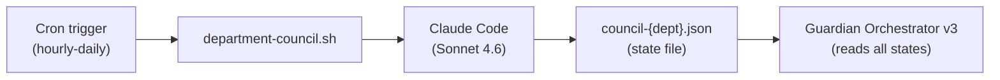
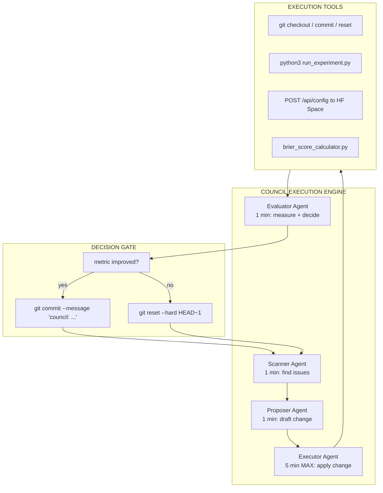
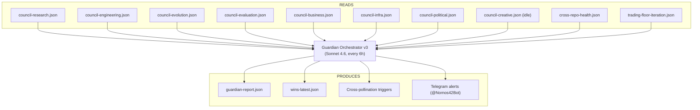

# 23 -- Councils v2 (Smart Councils with Real Execution)

> Evolution from JSON-state councils to real-execution councils | Guardian v3 | Real code changes
> Links: [[04-Departments]] | [[16-Karpathy-Pattern]] | [[12-Agent-Registry]]

---

## v1 vs v2 Comparison

| Feature | v1 (Current) | v2 (Target) |
|---------|-------------|-------------|
| Council output | JSON proposal only | JSON + actual code execution |
| Keep/Revert | Manual or simulated | Automated with git hooks |
| Measurement | Self-reported metrics | Verified against ground truth |
| Cross-pollination | Guardian reads JSON | Guardian triggers live actions |
| Free models | Advisory only | Can execute changes |
| Execution | `department-council.sh` shell | Python orchestrator with verification |

---

## Current Council Architecture (v1 -- Live)



Each department runs:
1. Shell script calls `claude -p "..."` with department context
2. Claude reads state file, proposes action, writes result
3. Guardian reads all 9 state files every 6h
4. Cross-pollination happens via Guardian JSON analysis

**Limitation:** Proposals are logged but not automatically executed. Engineer (user) must manually apply fixes.

---

## Target Council Architecture (v2 -- In Progress)



---

## 9 Department Councils -- Status & Metrics

### D1 Research
| Property | Value |
|----------|-------|
| Cron | `2 * * * *` (hourly) |
| State | `data/departments/council-research.json` |
| Iterations | 6 |
| Metric | Papers scanned, techniques extracted |
| v2 target | Auto-submit technique proposals to D2 Engineering |

### D2 Engineering
| Property | Value |
|----------|-------|
| Cron | `12 * * * *` (hourly) |
| State | `data/departments/council-engineering.json` |
| Iterations | 6 |
| Metric | Brier delta |
| v2 target | Auto-apply small code fixes (phantom game, odds sanity gate) |

Pending proposals from D4 Evaluation:
1. Phantom game guard (`assert home != away`) -- trivial, auto-applicable
2. Odds sanity gate (`|model - market| < 0.50`) -- small, auto-applicable
3. Platt scaling calibration -- medium, needs verification run

### D3 Evolution
| Property | Value |
|----------|-------|
| Cron | `22 * * * *` (hourly) |
| State | `data/departments/council-evolution.json` |
| Iterations | 8 |
| Metric | Fleet best Brier, diversity score |
| v2 target | Auto-trigger cross-pollination via `POST /api/config` |

**Pending actions (Guardian v3):**
- Seed S10 with S14 config (Brier gain: +0.00545)
- Seed S10 with S12 config (Brier gain: +0.00465)
- Seed S11 with S14 config (Brier gain: +0.00433)

### D4 Evaluation
| Property | Value |
|----------|-------|
| Cron | `20 */2 * * *` (every 2h) |
| State | `data/departments/council-evaluation.json` |
| Iterations | 5 |
| Metric | ECE, false positive rate |
| v2 target | Auto-flag and route fixes to D2 Engineering |

### D5 Betting
| Property | Value |
|----------|-------|
| Cron | `10 */2 * * *` (every 2h) |
| State | `data/departments/council-business.json` |
| Iterations | 1 |
| Metric | ROI, Sharpe, Kelly edge |
| v2 target | Auto-switch strategies based on ROI trend |

### D6 Infra
| Property | Value |
|----------|-------|
| Cron | `40 */2 * * *` (every 2h) |
| State | `data/departments/council-infra.json` |
| Iterations | 5 |
| Metric | Uptime %, RAM, disk |
| v2 target | Auto-kill idle processes, auto-restart failed services |

### D7 Political
| Property | Value |
|----------|-------|
| Cron | `0 8,20 * * *` (2x daily) |
| State | `data/departments/council-political.json` |
| Iterations | 7 |
| Metric | Political Brier, ETF ROI |
| v2 target | Auto-update political feature engine |

### D8 Creative (RGWA)
| Property | Value |
|----------|-------|
| Cron | `0 9,21 * * *` (2x daily) |
| State | (no state yet -- idle) |
| Iterations | 4 |
| Metric | Quality score, pieces/day |
| v2 target | Auto-run generation + quality scoring |

### D9 Cross-Repo
| Property | Value |
|----------|-------|
| Cron | Custom (manual) |
| State | `data/cross-repo-health.json` |
| Iterations | -- |
| Metric | Parity score, uncommitted changes |
| v2 target | Auto-sync feature engine across repos |

---

## Guardian Orchestrator v3

The Guardian sits above all 9 department councils and the Trading Floor:



**Current state:**
- Last run: 2026-04-04T06:01:06Z
- Departments loaded: 12/12
- Active cross-pollination routes: 1
- Wins this cycle: 0
- Pending actions: 3 MEDIUM (all evolution cross-pollination)

---

## Council Upgrade Roadmap

### Phase 1 (Current -- v1)
- All 9 councils run hourly/2x daily via cron
- Proposals stored in JSON state files
- Guardian reads all states and produces report
- User manually applies MEDIUM+ proposals

### Phase 2 (v2 -- Planned)
- Add "auto-apply" flag for LOW-risk changes
- D2 Engineering auto-applies trivial bug fixes
- D6 Infra auto-kills idle processes
- D3 Evolution auto-triggers cross-pollination via API

### Phase 3 (v2+ -- Future)
- Free models run their own proposal cycles (Qwen advisory -> Cerebras execution)
- Full auto-apply for all validated changes
- Rollback monitoring (auto-revert if metric degrades)
- Council-to-council direct routing (D4 -> D2 without Guardian intermediary)

---

## Council Communication Protocol

Agents communicate through:
1. **JSON state files** -- `data/departments/council-{dept}.json` (primary)
2. **metrics.jsonl** -- `data/departments/{dept}/metrics.jsonl` (history)
3. **Guardian report** -- `data/departments/guardian-report.json` (synthesis)
4. **Telegram** -- `@Nomos42Bot` alerts for HIGH+ priority items
5. **Git commits** -- tagged with `council:` prefix for traceability

### State File Schema

```json
{
  "dept": "engineering",
  "repo": "mon-ipad",
  "iteration": 6,
  "best_metric": null,
  "last_run": "2026-04-04T09:12:04Z",
  "status": "keep",
  "history": [
    {
      "iteration": 6,
      "ts": "2026-04-04T09:12:04Z",
      "scan": "No drift detected. Brier 0.2157 stable.",
      "proposal": "Monitor for drift across 3 more iterations",
      "result": "keep",
      "metrics": {
        "brier": { "value": 0.2157, "delta": 0.0 }
      }
    }
  ]
}
```

---

## Links

[[04-Departments]] | [[16-Karpathy-Pattern]] | [[12-Agent-Registry]] | [[01-Architecture]] | [[21-Free-Models]] | [[13-Tools]]
