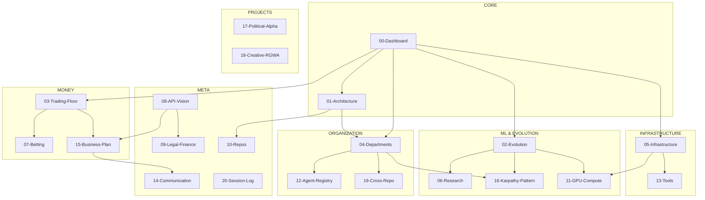

# Nomos42 -- Knowledge Vault

> The single source of truth for the Nomos42 NBA Quant AI ecosystem.
> 21 interconnected notes | Forge v19 | Updated: 2026-04-04

---

## Map of Content

---

## All Notes (21)

### Core

| Note | Purpose | Status |
|------|---------|--------|
| [[00-Dashboard]] | Live system overview, all metrics at a glance | ACTIVE |
| [[01-Architecture]] | Forge v19, 3 layers, 9 depts, Mermaid diagrams | STABLE |

### ML & Evolution

| Note | Purpose | Status |
|------|---------|--------|
| [[02-Evolution]] | 6 HF islands, GA configs, Brier scores, feature engine | RUNNING |
| [[06-Research]] | SOTA gap, 18 techniques, papers, feature roadmap | ACTIVE |
| [[16-Karpathy-Pattern]] | The autoresearch methodology, 5-min loops, council structure | REFERENCE |
| [[11-GPU-Compute]] | All GPU platforms: Kaggle, Colab, ZeroGPU, Lightning, Modal | REFERENCE |

### Money

| Note | Purpose | Status |
|------|---------|--------|
| [[03-Trading-Floor]] | 5 NBA + 5 Political traders, strategies, P&L | RUNNING |
| [[07-Betting]] | Live bankroll, Kelly sizing, categories, bugs | ACTIVE |
| [[15-Business-Plan]] | API marketplace, pricing, TAM, financial projections | PLANNED |

### Organization

| Note | Purpose | Status |
|------|---------|--------|
| [[04-Departments]] | All 9 departments with council status, Karpathy loops | RUNNING |
| [[12-Agent-Registry]] | ~264 agents, roles, council structure | REFERENCE |
| [[19-Cross-Repo]] | D9, repo sync, feature parity, cross-pollination | ACTIVE |

### Infrastructure

| Note | Purpose | Status |
|------|---------|--------|
| [[05-Infrastructure]] | VM, Laptop, iPad, HF Spaces, crons, bots | STABLE |
| [[13-Tools]] | Bloomberg terminal, scripts, monitoring, data files | REFERENCE |

### Projects

| Note | Purpose | Status |
|------|---------|--------|
| [[17-Political-Alpha]] | Political alpha, 22 categories, 743 features, ETF trading | RUNNING |
| [[18-Creative-RGWA]] | AI art generation, @RGWAbot, quality scoring | IDLE |

### Meta

| Note | Purpose | Status |
|------|---------|--------|
| [[08-API-Vision]] | API-first architecture, SaaS tiers, dashboard | PLANNED |
| [[09-Legal-Finance]] | SASU holding, BPI Deeptech, costs, compliance | PLANNED |
| [[10-Repos]] | All 5 repos + subtree with descriptions and health | STABLE |
| [[14-Communication]] | Social media, Telegram bots, investor deck, content | PRE-LAUNCH |
| [[20-Session-Log]] | Key decisions and milestones, dated | ONGOING |

---

## Quick Numbers (2026-04-04)

| Metric | Value | Target |
|--------|-------|--------|
| Best Brier (ATR) | **0.21570** (TabICL, Colab) | < 0.20 |
| Fleet best Brier | 0.22159 (S15, gen 1,042) | < 0.22 |
| SOTA reference | 0.199 (Montrucchio 2026) | beat it |
| Trading Floor | Iter 402, Gen 54,672 | -- |
| Grok bankroll | $3,687.51 (+3,587% ROI) | -- |
| Live bankroll | $91.89 / $100 (-8.11%) | > +5% ROI |
| Spaces | 8/8 UP (6 NBA + 2 POL) | 100% |
| Departments | 9/9 active + TF | all live |
| Total agents | ~196 (theoretical 264) | -- |

---

## Navigation Paths

| Path | Route |
|------|-------|
| **Status check** | [[00-Dashboard]] -> alert details |
| **Dive into ML** | [[02-Evolution]] -> [[06-Research]] -> [[16-Karpathy-Pattern]] |
| **Follow the money** | [[07-Betting]] -> [[03-Trading-Floor]] -> [[15-Business-Plan]] |
| **System health** | [[05-Infrastructure]] -> [[11-GPU-Compute]] -> [[13-Tools]] |
| **Organization** | [[01-Architecture]] -> [[04-Departments]] -> [[12-Agent-Registry]] |
| **Big picture** | [[08-API-Vision]] -> [[15-Business-Plan]] -> [[09-Legal-Finance]] |
| **All repos** | [[10-Repos]] -> [[19-Cross-Repo]] |
| **Projects** | [[17-Political-Alpha]] -- [[18-Creative-RGWA]] |
| **History** | [[20-Session-Log]] |

---

## Vault Tips

> [!tip] For Obsidian users
> - Open Graph View (Ctrl+G) to see all connections between notes
> - Use Ctrl+O to quick-switch between notes
> - Tags panel shows all #nomos42 content
> - Backlinks panel on each note shows what links TO that note
> - The Dashboard (00) links to everything -- start there

> [!info] Data freshness
> Most data in this vault is pulled from live JSON files in `data/`.
> The autonomous-cycle.sh updates these every 4 hours.
> For real-time status, check `data/agent-health.json` or `data/infra-status.json`.
